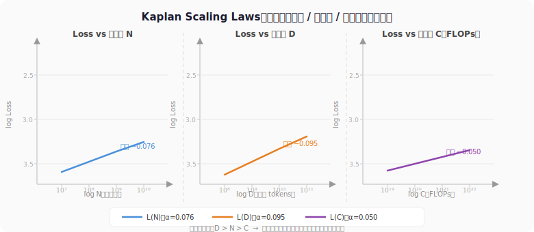
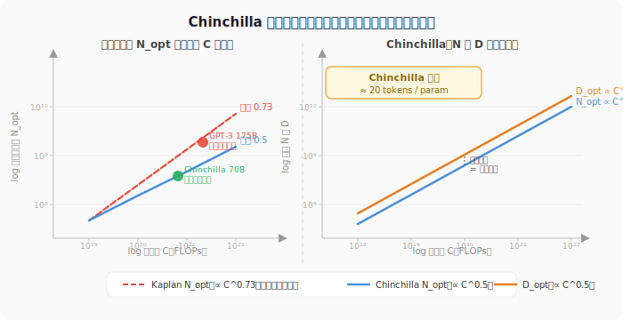
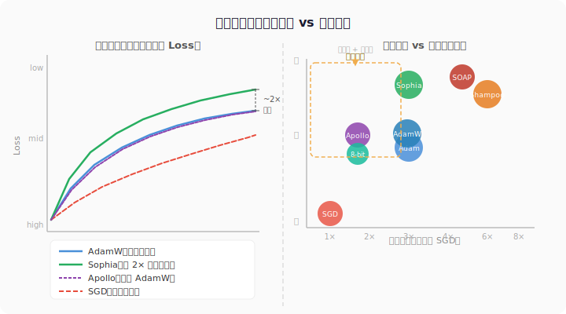
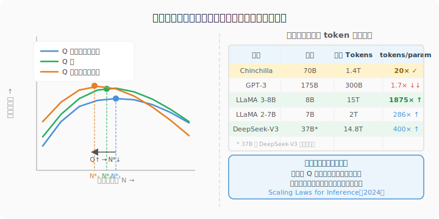

从 2014 年 Adam 一统深度学习优化江湖，经过 AdamW、Chinchilla Scaling Laws、muP，一路走到 2025 年的 Apollo——这条演进路线的背后，是一个被反复追问的问题：**在固定的计算预算下，怎么把每一块钱、每一个 FLOP、每一个字节的内存都用在刀刃上？**

从第一性原理出发，把每一步改进背后的动机讲清楚：为什么 Adam 打败了 SGD，为什么 AdamW 才是正确的正则化，Chinchilla 如何推翻了 GPT-3 时代的训练法则，以及为什么最近的优化器研究正在重新发现二阶方法的价值。

<!-- more -->

---

## 从 SGD 到 Adam：为什么需要自适应学习率

深度学习的优化问题在表面上很简单：给定损失函数 $\mathcal{L}(\theta)$，找到让损失最小的参数 $\theta$。但实践中，这个问题极其棘手：

1. **各参数的梯度尺度差异极大**。在语言模型中，词频高的词对应的 embedding 梯度很大，词频低的梯度极小——用同一个学习率更新它们，要么大梯度的参数振荡，要么小梯度的参数几乎不动。

2. **损失曲面极不均匀**。不同方向的曲率（即二阶导数）差异可以达到几个数量级，导致梯度下降在某些方向上步子太大、在另一些方向上步子太小。

SGD 用固定学习率，无法解决上述两个问题。自适应学习率方法（AdaGrad → RMSprop → Adam）的出现，正是为了让每个参数有自己的"自适应步长"。

---

## Adam：深度学习优化的基石

> 论文：[Adam: A Method for Stochastic Optimization](https://arxiv.org/abs/1412.6980)（Kingma & Ba, 2014）

### 核心算法

Adam 同时维护两个指数移动平均：

$$m_t = \beta_1 m_{t-1} + (1 - \beta_1) g_t \quad \text{（一阶矩，梯度的移动平均）}$$

$$v_t = \beta_2 v_{t-1} + (1 - \beta_2) g_t^2 \quad \text{（二阶矩，梯度平方的移动平均）}$$

由于初始化为零，存在初期偏差，需要做偏差修正：

$$\hat{m}_t = \frac{m_t}{1 - \beta_1^t}, \quad \hat{v}_t = \frac{v_t}{1 - \beta_2^t}$$

最终参数更新：

$$\theta_{t+1} = \theta_t - \frac{\eta}{\sqrt{\hat{v}_t} + \epsilon} \cdot \hat{m}_t$$

### 为什么 Adam 好

- $m_t$ 提供动量（momentum），在曲率小的方向上积累速度，避免梯度噪声造成的抖动
- $\sqrt{v_t}$ 提供自适应缩放：梯度大的参数步长小，梯度小的参数步长大——自动解决参数梯度尺度不均的问题
- 默认超参数 $\beta_1 = 0.9, \beta_2 = 0.999, \epsilon = 10^{-8}$ 在绝大多数任务上无需调整

Adam 的缺点是内存占用是 SGD 的 3 倍：参数 $\theta$、一阶矩 $m$、二阶矩 $v$ 各需要一份存储。对于现代 LLM 来说，这是不小的负担——700 亿参数的模型，仅优化器状态就需要约 280GB 的 BF16 内存。

---

## AdamW：正确的正则化

> 论文：[Decoupled Weight Decay Regularization](https://arxiv.org/abs/1711.05101)（Loshchilov & Hutter, 2017）

### 为什么 Adam + L2 不等于 Weight Decay

许多人以为 Adam 配上 L2 正则化等价于 weight decay，但事实并非如此。

L2 正则化把 $\lambda \|\theta\|^2$ 加到损失函数里，等价于在梯度里加上 $2\lambda \theta$：

$$g_t' = g_t + 2\lambda \theta_t$$

然后把 $g_t'$ 代入 Adam 的自适应缩放公式。问题在于：自适应缩放会把这个正则化梯度也除以 $\sqrt{v_t}$，导致**正则化的强度随梯度大小自适应变化**——梯度大的参数正则化弱，梯度小的参数正则化强。这不是我们想要的行为。

Weight Decay 的语义是"每次更新后，参数向零收缩一个固定比例"，应该独立于梯度更新：

$$\theta_{t+1} = (1 - \lambda) \theta_t - \frac{\eta}{\sqrt{\hat{v}_t} + \epsilon} \cdot \hat{m}_t$$

这就是 AdamW 的做法：**解耦（decouple）weight decay 和梯度更新**，不通过损失函数施加，而是在参数更新时单独施加。

### 实践影响

这个看似微小的改动，在 LLM 训练中影响显著。Ilya Loshchilov 在论文中展示，AdamW 在 ImageNet 训练上的泛化性能系统性地优于 Adam + L2。如今，几乎所有 LLM 训练框架（PyTorch、Hugging Face、JAX）的默认优化器都是 AdamW，而不是 Adam。

正确的权重衰减系数通常在 $0.01$–$0.1$ 之间，嵌入层往往不施加 weight decay（因为词频不均导致部分 embedding 梯度极小，weight decay 会过度收缩这些参数）。

---

## 大批量训练：LAMB

> 论文：[Large Batch Optimization for Deep Learning: Training BERT in 76 minutes](https://arxiv.org/abs/1904.00962)（You et al., 2019）

有了 AdamW 作为稳健的基础优化器，下一个工程瓶颈随即暴露出来：模型规模增大后，单卡装不下，必须做多卡分布式训练。分布式训练的吞吐量直接取决于 batch size——每次迭代能喂进去的 token 越多，GPU 利用率越高，通信等待的比例越低。因此，增大 batch size 是加速分布式训练最直接的手段。但批量太大时，梯度方差下降，更新方向过于"平均"，模型容量反而下降。

LAMB（Layer-wise Adaptive Moments optimizer for Batching training）针对大批量训练做了关键改进：**层级自适应学习率缩放（layer-wise learning rate scaling）**。

### 发现路径：从 LARS 失败到 LAMB

trust ratio 的想法并非 LAMB 首创。2017 年 Google Brain 提出的 LARS（Layer-wise Adaptive Rate Scaling）已经用「参数范数 / 更新范数」这个比值来逐层控制步长，并成功将 ResNet-50 的 ImageNet 训练扩展到 32K 的超大批量。

You 等人最初尝试直接把 LARS 搬到 BERT 上，结果发现 batch size 超过 8K 之后训练直接发散。问题的根源在于：LARS 底层用的是 momentum SGD，它对所有维度一视同仁；而 BERT 这类 attention 模型对不同维度的梯度尺度差异极为敏感——attention 矩阵和 FFN 层的梯度分布迥异，需要逐维度的自适应缩放才能稳定训练。

**LAMB 的核心洞察**：LARS 的层级缩放和 Adam 的维度级自适应是互补的，而非替代关系。把两者叠加——先用 AdamW 做维度级归一化，再用 trust ratio 做层级归一化——才能同时应对两个问题。

论文 Theorem 2 从理论上解释了为什么层级归一化有效：它使收敛界依赖于各层平均平滑度 $L_\text{avg}$，而非最坏层的 $L_\infty$，从数学上保证了逐层独立控制步长比全局统一学习率更稳。

### 算法

$$r_t = \text{AdamW update direction}$$
$$\text{trust ratio}_t = \frac{\|\theta_t\|}{\|r_t\|}$$
$$\theta_{t+1} = \theta_t - \eta \cdot \text{trust ratio}_t \cdot r_t$$

每一层独立计算 trust ratio：参数范数代表该层参数的「当前尺度」，更新范数代表 AdamW 建议的步长大小，两者之比把步长归一化到与参数本身量级相称的范围内，防止某层因梯度异常大而步长失控。

LAMB 使 BERT 的训练可以扩展到 65536 的极大批量，训练时间从 3 天压缩到 76 分钟（1024 块 TPU），不损失精度。对于需要快速迭代的 LLM 预训练，LAMB 是大批量分布式训练的重要基础。

---

## Scaling Laws：训练的第一性原理

> 论文：[Scaling Laws for Neural Language Models](https://arxiv.org/abs/2001.08361)（Kaplan et al., OpenAI, 2020）

2020 年，Kaplan 等人发表了一篇改变了整个 LLM 领域思维方式的论文：语言模型的性能（交叉熵损失）与三个变量之间存在精确的幂律关系。

### 三个核心幂律

三个公式共享同一个结构：$L(X) \approx (X_c / X)^{\alpha}$，其中 $X_c$ 是从实验数据拟合出来的常数，物理含义是「当 $X = X_c$ 时，loss 恰好等于 1」——它本身没有独立的理论意义，只是幂律曲线的一个锚点，用来定标纵轴的绝对值。$\alpha$ 才是核心：它描述 loss 随 $X$ 增大下降的速率，$\alpha$ 越大，多投入一倍资源带来的收益越显著。

**1. 参数量 $N$：**

$$L(N) \approx \left(\frac{N_c}{N}\right)^{\alpha_N}, \quad \alpha_N \approx 0.076$$

在训练数据充足的前提下，模型越大，loss 越低，且是幂律关系。

**2. 数据量 $D$：**

$$L(D) \approx \left(\frac{D_c}{D}\right)^{\alpha_D}, \quad \alpha_D \approx 0.095$$

**3. 计算量 $C$（FLOP）：**

$$L(C) \approx \left(\frac{C_c}{C}\right)^{\alpha_C}, \quad \alpha_C \approx 0.050$$

### 计算最优分配

给定固定计算预算 $C$，应该如何分配给模型大小和训练 token 数？Kaplan 等人的结论是：**应该优先扩大模型**，在固定 $C$ 的条件下：

$$N_{\text{opt}} \propto C^{0.73}, \quad D_{\text{opt}} \propto C^{0.27}$$

这两个指数描述的是：计算预算翻倍时，最优参数量应增长 $2^{0.73} \approx 1.66$ 倍，而最优训练 token 数只需增长 $2^{0.27} \approx 1.20$ 倍——新增预算的大头应该砸到更大的模型上，而不是更多的数据上。

注意指数本身并不直接比较 ROI，而是描述最优分配点随预算变化的轨迹。准确的表述是：在最优分配点附近，把一个额外的 FLOP 分给模型（扩参数）比分给数据（加 token）带来更多的 loss 下降。这个结论直接影响了 GPT-3（2020）的设计决策：花大力气做了一个 1750 亿参数的大模型，而训练 token 数（约 300B）相对较少。

但这个结论是错的，两年后被 Chinchilla 推翻了。



---

## Chinchilla：重新校准训练法则

> 论文：[Training Compute-Optimal Large Language Models](https://arxiv.org/abs/2203.15556)（Hoffmann et al., DeepMind, 2022）

### GPT-3 为什么训练不足

Kaplan 等人的幂律分析存在一个方法论问题：他们固定模型大小，观察损失随 token 数的变化；但没有充分探索"等 FLOP 预算下，小模型多训练 vs 大模型少训练"的对比空间。

Hoffmann 等人重新设计了实验：训练了超过 400 个不同参数量和训练 token 数组合的模型，系统覆盖了 FLOP 预算从 $10^{18}$ 到 $10^{23}$ 的范围。他们拟合的 scaling law 是：

$$L(N, D) = E + \frac{A}{N^{\alpha}} + \frac{B}{D^{\beta}}$$

其中 $E \approx 1.69$（不可约损失），$\alpha \approx 0.34$，$\beta \approx 0.28$。

### Chinchilla 定律：20 tokens per parameter

最优分配下，模型大小和训练 token 数应该**等比例增长**：

$$N_{\text{opt}} \propto C^{0.5}, \quad D_{\text{opt}} \propto C^{0.5}$$

更直白的表述：**每个参数对应约 20 个训练 token 时，模型是计算最优的**。

对比：
- GPT-3（175B）：300B tokens，约 1.7 tokens/param，严重训练不足
- Chinchilla（70B）：1.4T tokens，20 tokens/param，计算最优

结果：计算量仅为 GPT-3 四分之一的 Chinchilla，在所有测试基准上全面超越 GPT-3。

这个发现彻底改变了 LLM 的训练策略。LLaMA 系列（从 7B 到 70B）都遵循"训练 token 数远超 Chinchilla 最优"的策略（因为推理成本固定，推理量足够多时，训练时多花计算是值得的）。



---

## 超参数转移：muP

> 论文：[Tensor Programs V: Tuning Large Neural Networks via Zero-Shot Hyperparameter Transfer](https://arxiv.org/abs/2203.03466)（Yang et al., Microsoft, 2022）

### 超参数搜索的痛点

大模型训练有一个实践上的难题：学习率、初始化缩放等超参数在小模型上调好之后，放到大模型上往往失效，需要重新搜索。但大模型的每次实验代价极高，无法做大量超参数搜索。

### muP 的核心思路

最大更新参数化（Maximal Update Parametrization, muP）从理论上分析了权重的初始化尺度和学习率应该如何随模型宽度（width）$n$ 缩放，使得激活值的分布在任意宽度下保持一致。

关键缩放规则：

| 参数类型 | 标准参数化（SP） | muP |
| --- | --- | --- |
| 隐藏层学习率 | $\eta$ | $\eta / n$ |
| 隐藏层权重初始化 | $\mathcal{N}(0, 1/n)$ | $\mathcal{N}(0, 1/n)$ |
| 输出层学习率 | $\eta$ | $\eta / n$ |
| 嵌入层学习率 | $\eta$ | $\eta$ |

在 muP 下，最优学习率在所有模型宽度（4→65536）上保持一致，可以在**数百万参数的小模型**上搜索最优超参数，然后**零样本转移到千亿参数的大模型**。

### 实践价值

微软在 GPT-3 规模的模型上验证，muP 找到的超参数比默认超参数在 loss 上低约 0.05 nats，相当于节省了约 30% 的训练计算量。LLaMA 3、Qwen 等主流 LLM 的训练都报告使用了类似 muP 的超参数转移策略。

---

## 二阶方法：理论上更优，实践上更难

Adam 本质上是一阶方法：它用梯度的平方来近似 Hessian 的对角线，但忽略了参数之间的二阶交叉项。二阶方法直接利用 Hessian（或 Fisher Information Matrix）来预处理梯度，理论收敛速度更快。

### Shampoo：矩阵预处理

> 论文：[Shampoo: Preconditioned Stochastic Tensor Optimization](https://arxiv.org/abs/1802.09568)（Gupta et al., Google, 2018）

对于二维权重矩阵 $W \in \mathbb{R}^{m \times n}$，Shampoo 维护两个矩阵积累器：

$$L_t = \sum_{s=1}^{t} G_s G_s^T \in \mathbb{R}^{m \times m}, \quad R_t = \sum_{s=1}^{t} G_s^T G_s \in \mathbb{R}^{n \times n}$$

更新规则：

$$W_{t+1} = W_t - \eta \cdot L_t^{-1/4} \cdot G_t \cdot R_t^{-1/4}$$

这等价于用 Fisher 矩阵的 Kronecker 积分解来预处理梯度，捕捉了参数间的相关性。代价是需要存储和定期更新 $L_t$ 和 $R_t$，对于大矩阵来说内存和计算开销都很高。

### Sophia：轻量级 Hessian 对角线

> 论文：[Sophia: A Scalable Stochastic Second-order Optimizer for Language Model Pre-training](https://arxiv.org/abs/2305.14342)（Liu et al., Stanford, 2023）

Sophia 的思路是只估计 Hessian 的对角线，而不是全矩阵或 Kronecker 分解。Hessian 对角线 $h_t$ 用 Hutchinson 估计器定期（每 $k$ 步）更新：

$$h_t = \mathbb{E}[g \odot g] \approx \hat{g}_t^2 \quad \text{（用当前批次梯度平方估计）}$$

更新规则：

$$\theta_{t+1} = \theta_t - \eta \cdot \text{clip}\!\left(\frac{m_t}{\max(h_t, \epsilon)}, \rho\right)$$

其中 $\text{clip}(\cdot, \rho)$ 限制更新的最大幅度，防止 Hessian 估计噪声导致步长过大。

实验结果：Sophia 在 GPT-2（125M 到 770M）的预训练上比 AdamW 快约 2 倍（达到相同 loss 所需步数减半），内存开销与 AdamW 相当。



---

## 内存的诅咒：大模型训练的新瓶颈

### 8-bit 优化器状态

> 论文：[8-bit Optimizers via Block-wise Quantization](https://arxiv.org/abs/2110.02861)（Dettmers et al., 2021）

AdamW 训练一个 7B 参数的模型需要：参数（14GB BF16）+ 梯度（14GB BF16）+ 一阶矩（28GB FP32）+ 二阶矩（28GB FP32）= **84GB**。仅优化器状态就占了 56GB。

8-bit 量化的思路是：把优化器的一阶矩和二阶矩量化到 8-bit 存储，在更新时再反量化回 FP32 计算。通过**分块动态量化（block-wise dynamic quantization）**，每 256 个值共享一个量化范围，保证量化误差不积累。

结果：优化器状态内存从 56GB 降到 14GB（4 倍压缩），而模型质量几乎无损失。

### Apollo：单 GPU 训练 7B 模型

> 论文：[Apollo: SGD-like Memory, AdamW-level Performance](https://arxiv.org/abs/2412.05270)（Zhu et al., 2025）

Apollo 走得更彻底：能否在 SGD 级别的内存（只存参数和梯度）下，实现 AdamW 级别的收敛速度？

关键洞察：AdamW 的优化器状态本质上是在做**通道级（channel-wise）的梯度缩放**。Apollo 用低秩近似来近似这个缩放：维护一个辅助的低秩矩阵（rank-1 到 rank-8）来估计每层的梯度缩放因子，而不是存储完整的一阶和二阶矩。

$$\text{Apollo-Mini update: } \Delta W_t = -\eta \cdot \frac{g_t}{\|g_t\|_{\text{channel}} / \|m_t\|_{\text{channel}} + \epsilon}$$

其中"channel norm"是每个输出通道的梯度/动量范数，这个比值提供了通道级的自适应学习率，而不需要存储完整的二阶矩。

效果：从头训练 LLaMA-7B，Apollo-Mini 在单块 A100（80GB）上就可以完成，而 AdamW 需要至少 8 块；在相同 loss 下，Apollo 的吞吐量是 AdamW 的 3 倍。

---

## 学习率调度的终结：Schedule-Free

> 论文：[Schedule-Free Learning—A New Way to Train](https://arxiv.org/abs/2405.15682)（Defazio et al., Meta, 2024）

几乎所有 LLM 训练都使用**余弦学习率调度（cosine learning rate schedule）**：学习率从峰值开始按余弦曲线衰减到接近零。这个设计的一个隐含假设是：**训练开始前必须知道总步数**。

但现实中，很多训练是持续进行的（continual learning），或者需要在训练过程中根据 loss 曲线决定何时停止。余弦调度无法适应这些场景。要理解 Schedule-Free 为什么能绕过这个约束，需要先搞清楚「学习率衰减」究竟在做什么。

### 学习率衰减与迭代平均：一个隐藏的等价关系

直觉上，学习率衰减的作用是「训练后期走小步，避免在最优解附近震荡」。但 Defazio 等人指出，这个效果其实和另一个操作等价：**对历史迭代点做加权平均（Polyak-Ruppert averaging）**。

为什么？设想用固定学习率 $\gamma$ 更新的 SGD，每一步产生一个参数点 $z_1, z_2, \ldots, z_T$。这些点在最优解附近随机游走，单个点噪声很大；但它们的**等权平均** $\bar{z}_T = \frac{1}{T}\sum_{t=1}^T z_t$ 的噪声会以 $1/\sqrt{T}$ 的速率消减——这在数学上等价于用线性衰减学习率训练到第 $T$ 步所达到的精度。

这个等价关系的关键含义是：**学习率衰减「知道」训练要在 $T$ 步结束，所以它能把衰减节奏校准到恰好在第 $T$ 步收敛。而迭代平均不需要知道 $T$——随时停下来，平均结果就是当前最好的近似。**

### 两个参数序列

Schedule-Free 把这个等价关系变成了一个实用的优化器，维护两条并行的参数轨迹：

- **$z_t$（工作参数，work parameters）**：用固定学习率 $\gamma$ 做梯度更新，步伐大，探索快，但点本身噪声大
- **$x_t$（评估参数，evaluation parameters）**：$z$ 序列的指数加权历史平均，平滑稳定，用于推理和评估

两者的关系：

$$x_{t+1} = (1 - c_{t+1})\, x_t + c_{t+1}\, z_{t+1}, \quad c_{t+1} = \frac{1}{t+1}$$

这里 $c_{t+1}$ 随步数自动递减——越到后期，新的 $z$ 点对平均值的影响越小，等价于一个「截止在当前步」的线性衰减调度。这正是它无需预设 $T$ 的原因：每一步它都在模拟一个「刚好在此刻结束」的衰减调度，随时停下来都是最优的。

### 梯度在哪里计算？

一个微妙但关键的细节：梯度不在 $z_t$ 上算，也不在 $x_t$ 上算，而是在两者之间插值的第三个点 $y_t$ 上算：

$$y_t = (1 - \beta)\, z_t + \beta\, x_t$$

然后用 $y_t$ 处的梯度更新 $z_t$：

$$z_{t+1} = z_t - \gamma \nabla \mathcal{L}(y_t, \zeta_t)$$

$\beta \approx 0.9$ 时，$y_t$ 接近于历史平均 $x_t$，但仍带有一部分当前 $z_t$ 的方向信息。这种插值的作用是在「在噪声大的当前点算梯度（快但不稳）」和「在平滑的历史平均点算梯度（稳但滞后）」之间取得平衡。论文证明，对任意 $\beta \in [0,1]$，这个设计的最坏情况收敛率都是最优的：

$$\mathbb{E}[F(x_T) - F(x^*)] \leq \frac{DG}{\sqrt{T}}$$

其中 $D$ 是初始参数到最优解的距离，$G$ 是梯度上界——这个界与经典 SGD 相同，但不需要任何调度。

### 结合 AdamW

Schedule-Free 本身是一个框架，可以套在任何基础优化器上。与 AdamW 结合时，步骤是：

1. 在 $y_t$ 处计算梯度 $g_t = \nabla \mathcal{L}(y_t)$
2. 用 $g_t$ 更新 AdamW 的一阶矩 $m_t$ 和二阶矩 $v_t$
3. 计算 AdamW 的更新方向 $\Delta_t = m_t / (\sqrt{v_t} + \epsilon)$，并施加 weight decay
4. 更新工作参数：$z_{t+1} = z_t - \gamma \cdot \Delta_t$
5. 更新评估参数：$x_{t+1} = (1 - c_{t+1}) x_t + c_{t+1} z_{t+1}$

推理时用 $x_t$，训练时梯度在 $y_t$ 上算，参数更新落在 $z_t$ 上——三者各司其职。

### 具体数值例子：三步对比

用一个极简的一维例子，把两种方法的每步计算并排列出来。设初始参数 $\theta_0 = 10.0$，真实最优解 $\theta^* = 0$，每步梯度 $g_t = \theta_t$（梯度正比于参数，模拟二次损失），固定学习率 $\gamma = 0.5$，计划训练 $T = 4$ 步，$\beta = 0$（简化，不用插值点，梯度直接在 $x_t$ 上算）。

**标准 AdamW + 线性衰减调度**（提前知道 $T=4$）

线性衰减调度：第 $t$ 步学习率 $\eta_t = \gamma \cdot (1 - t/T) = 0.5 \cdot (1 - t/4)$

| 步 | $\eta_t$ | $g_t = \theta_{t-1}$ | $\theta_t = \theta_{t-1} - \eta_t \cdot g_t$ |
|---|---|---|---|
| 1 | $0.375$ | $10.0$ | $10.0 - 0.375 \times 10.0 = 6.25$ |
| 2 | $0.250$ | $6.25$  | $6.25 - 0.250 \times 6.25 = 4.69$ |
| 3 | $0.125$ | $4.69$  | $4.69 - 0.125 \times 4.69 = 4.10$ |
| 4 | $0.000$ | $4.10$  | $4.10$（最后一步学习率为零，停止更新） |

训练完的模型参数：$\theta_4 = 4.10$。

---

**Schedule-Free SGD**（完全不知道会训练几步）

固定学习率 $\gamma = 0.5$，梯度在评估参数 $x_t$ 上计算，更新落在工作参数 $z_t$ 上，$c_{t+1} = 1/(t+1)$。

初始状态：$z_0 = x_0 = 10.0$

**$t = 1$：**
- 插值点（$\beta=0$）：$y_1 = x_0 = 10.0$
- 梯度：$g_1 = y_1 = 10.0$
- 更新工作参数：$z_1 = z_0 - \gamma \cdot g_1 = 10.0 - 0.5 \times 10.0 = 5.0$
- 更新评估参数（$c_1 = 1/1 = 1.0$）：$x_1 = (1-1.0) \times 10.0 + 1.0 \times 5.0 = 5.0$
- 此时如果停下来：输出 $x_1 = 5.0$

**$t = 2$：**
- 插值点：$y_2 = x_1 = 5.0$
- 梯度：$g_2 = 5.0$
- 更新工作参数：$z_2 = 5.0 - 0.5 \times 5.0 = 2.5$
- 更新评估参数（$c_2 = 1/2 = 0.5$）：$x_2 = (1-0.5) \times 5.0 + 0.5 \times 2.5 = 2.5 + 1.25 = 3.75$
- 此时如果停下来：输出 $x_2 = 3.75$

**$t = 3$：**
- 插值点：$y_3 = x_2 = 3.75$
- 梯度：$g_3 = 3.75$
- 更新工作参数：$z_3 = 2.5 - 0.5 \times 3.75 = 0.625$
- 更新评估参数（$c_3 = 1/3 \approx 0.333$）：$x_3 = (1-0.333) \times 3.75 + 0.333 \times 0.625 = 2.50 + 0.208 = 2.71$
- 此时如果停下来：输出 $x_3 = 2.71$

**$t = 4$：**
- 插值点：$y_4 = x_3 = 2.71$
- 梯度：$g_4 = 2.71$
- 更新工作参数：$z_4 = 0.625 - 0.5 \times 2.71 = -0.73$
- 更新评估参数（$c_4 = 1/4 = 0.25$）：$x_4 = (1-0.25) \times 2.71 + 0.25 \times (-0.73) = 2.03 - 0.18 = 1.85$
- 输出 $x_4 = 1.85$

---

**对比结果（最优解 $\theta^* = 0$）：**

| 方法 | 第4步输出 | 距最优解 | 备注 |
|---|---|---|---|
| 线性衰减调度 | $4.10$ | $4.10$ | 最后一步学习率归零，反而冻结在远处 |
| Schedule-Free | $1.85$ | $1.85$ | 工作参数 $z_4 = -0.73$ 已越过最优解，但评估参数 $x_4$ 是历史平均，稳定在更好的位置 |

注意这个例子为了简洁设 $T=4$ 步，线性衰减表现较差。现实中余弦调度经过精心调整后性能与 Schedule-Free 相当——这里的数值对比只是为了展示两者的**计算流程差异**，不代表两者的真实性能差距。

关键观察：**Schedule-Free 里，$z_t$（工作参数）走得激进、噪声大（第4步已经冲过头变成 $-0.73$），$x_t$（评估参数）是它的历史平均，起到缓冲和稳定的作用，最终输出的是 $x_t$ 而不是 $z_t$。** 这就是两个参数序列分工的直觉。

### 实际效果与局限

在 GPT-3 规模的语言模型上，Schedule-Free AdamW 与精心调整余弦调度的 AdamW 性能相当，且完全不需要指定训练步数、峰值学习率衰减终点等调度超参数。

但有一点需要注意：Schedule-Free 并非「超越」余弦调度，而是在「不知道总步数」的约束下达到了相同质量。如果训练步数固定已知，精心调校的余弦调度仍然可以略优——余弦调度的最后阶段急剧衰减，让模型在收敛的最后一程走得比迭代平均更快更准。Schedule-Free 的价值在于**灵活性**，而不是绝对性能的提升。

---

## 工程前沿：Scaling Laws for Inference

> 论文：[Scaling Laws for Inference](https://arxiv.org/abs/2404.10102)（Sardana & Frankle, 2024）

Chinchilla 解决了"训练时如何分配计算"的问题，但没有回答另一个问题：**如果把推理成本也考虑进来，最优训练策略会如何变化？**

当一个模型要服务大量请求时，推理 FLOP 的总量可能远超训练 FLOP。

### 推理感知的最优训练

设训练 FLOP 为 $C_{\text{train}}$，模型将在其生命周期内接收 $Q$ 次推理请求，每次推理 FLOP 约为 $C_{\text{inf}}(N) \propto N$（正比于参数量）。总成本：

$$C_{\text{total}} = C_{\text{train}} + Q \cdot C_{\text{inf}}(N)$$

在固定 $C_{\text{total}}$ 的约束下，最优的 $N$ 和 $D$ 满足：

$$N_{\text{opt}} \propto \left(\frac{C_{\text{total}}}{Q}\right)^{a}, \quad \text{其中 } a < 0.5$$

关键结论：**推理请求越多（$Q$ 越大），最优模型越小**——因为小模型的推理代价低，可以通过多训练来补偿参数少的劣势。这直接解释了为什么 LLaMA-3 8B 模型要训练到 15T tokens（Chinchilla 最优约为 160B tokens），远超 Chinchilla 比例：Meta 预计这个模型会被部署到极大量的请求，多训练的收益能从推理省钱中收回来。



---

## SOAP 与 SOAP：连接 Adam 与 Shampoo

> 论文：[SOAP: Improving and Stabilizing Shampoo using Adam](https://arxiv.org/abs/2409.11321)（Vyas et al., 2024）

Shampoo 理论上更优，但实践上内存开销大且训练不稳定。SOAP（Shampoo as Adam in the eigenbasis）提出了一个优雅的等价视角：

**Shampoo 等价于在其 Kronecker 因子的特征基（eigenbasis）中运行 Adam。**

具体来说：
1. 计算 Shampoo 的左右 Kronecker 因子 $L_t$ 和 $R_t$ 的特征分解：$L_t = U_L \Lambda_L U_L^T$，$R_t = U_R \Lambda_R U_R^T$
2. 把梯度变换到特征基：$\tilde{G}_t = U_L^T G_t U_R$
3. 在特征基中运行 Adam：$\tilde{m}_t, \tilde{v}_t$ 用 Adam 更新公式
4. 把更新变换回原始空间：$\Delta W_t = U_L \tilde{\Delta}_t U_R^T$

这个等价关系的好处是：可以用 Adam 稳定的数值特性来稳定 Shampoo 的训练（原始 Shampoo 需要仔细处理特征值接近零的情况），同时保留 Shampoo 的二阶预处理优势。

实验结果：SOAP 在 GPT-2（124M）到 1.3B 参数的 LLM 预训练上，比 AdamW 少用约 40% 的迭代步数达到相同 loss，墙钟时间节省约 35%，而内存开销与 Shampoo 相当（比 AdamW 高 2-4 倍）。

---

## 超大上下文：MiniMax-01 的线性注意力

> 论文：[MiniMax-01: Scaling Foundation Models with Lightning Attention](https://arxiv.org/abs/2501.08313)（MiniMax, 2025）

Transformer 的 $O(n^2)$ 注意力复杂度是制约超长上下文训练的根本瓶颈。MiniMax-01 将**线性注意力**（linear attention）与 MoE 结合，实现了在 456B 参数、1M token 上下文的工业级训练。

### 线性注意力的核心思想

标准注意力：

$$O = \text{softmax}\!\left(\frac{QK^T}{\sqrt{d}}\right) V$$

计算 $QK^T$ 的复杂度是 $O(n^2 d)$。利用矩阵乘法结合律：

$$O = \phi(Q) \cdot (\phi(K)^T V)$$

其中 $\phi$ 是某个特征映射（替代 softmax），先计算 $\phi(K)^T V \in \mathbb{R}^{d \times d}$（$O(nd^2)$），再计算 $\phi(Q) \cdot (\phi(K)^T V)$（$O(nd^2)$），整体复杂度降到 $O(nd^2)$，对序列长度线性！

### Lightning Attention

MiniMax 的 Lightning Attention 是 Flash Linear Attention 的 I/O-aware 实现版本，把线性注意力的计算分块 tile 到 SRAM，避免大矩阵在 HBM 和 SRAM 之间的频繁搬运，实现了硬件友好的线性注意力。

结合 MoE（32 个专家，45.9B 活跃参数），MiniMax-01 在标准 LLM 基准上达到了与 GPT-4o、Claude-3.5-Sonnet 相当的水平，同时支持 20-32 倍于标准模型的上下文长度。

---

## 现代 LLM 训练全景

把所有优化决策放在一起，现代 LLM 的训练流程已经高度标准化：

**优化器配置（2023–2025 主流选择）：**

| 组件 | 主流选择 | 备选 |
| --- | --- | --- |
| 基础优化器 | AdamW | Sophia（更快，内存相当） |
| 内存优化 | BF16 混合精度 | 8-bit 优化器状态 |
| 学习率调度 | 余弦 + warmup | Schedule-Free |
| 权重衰减 | 0.01–0.1 | 嵌入层通常不衰减 |
| 梯度裁剪 | max norm 1.0 | — |
| 超参数搜索 | muP（小模型转移） | — |

**训练规模决策：**

| 模型规模 | Chinchilla 最优 tokens | 实际训练 tokens（推理量大时） |
| --- | --- | --- |
| 7B | ~140B | 1–15T |
| 70B | ~1.4T | 2–8T |
| 405B | ~8T | — |

**新一代优化器趋势（2024–2025）：**
- **SOAP**：Adam-稳定性 + Shampoo-二阶预处理，内存代价约 2-4× AdamW
- **Apollo**：SGD 内存 + AdamW 收敛质量，适合显存受限场景
- **Schedule-Free**：无需预设训练步数，适合持续学习场景

---

## 回望这条路

```
SGD（梯度下降的起点）
    ↓ 问题：固定学习率，参数梯度尺度不均
Adam（2014，自适应一阶矩 + 二阶矩）
    ↓ 问题：L2 正则化在自适应优化器中失效
AdamW（2017，解耦 weight decay）
    ↓ 工业标配：所有现代 LLM 的默认优化器
LAMB（2019，层级自适应缩放）
    ↓ 使能：大批量分布式训练
Scaling Laws（2020，OpenAI）
    ↓ 发现：损失是参数量/数据量的幂律
    ↓ 错误结论：优先扩大模型（GPT-3 训练不足）
Chinchilla（2022，DeepMind）
    ↓ 纠正：等比例扩大参数和数据，20 tokens/param
muP（2022，Microsoft）
    ↓ 使能：超参数从小模型零样本转移到大模型
8-bit Optimizers（2021）→ Apollo（2025）
    ↓ 方向：内存效率，从 3× AdamW 到 1× SGD
Shampoo（2018）→ Sophia（2023）→ SOAP（2024）
    ↓ 方向：二阶预处理，收敛更快
Scaling Laws for Inference（2024）
    ↓ 新维度：把推理成本纳入训练决策
Schedule-Free（2024）
    ↓ 新维度：消除对固定训练时长的依赖
```

贯穿这条路线的有三个张力：

**第一，参数量 vs 数据量**。Scaling Laws 和 Chinchilla 的争论揭示了 LLM 训练的根本权衡：在固定计算预算下，这两者如何分配决定了训练效率的上限。答案不是固定的，而是随推理量动态变化。

**第二，收敛速度 vs 内存开销**。从 Adam 到 Shampoo/Sophia/SOAP，二阶方法一直承诺更快的收敛，但代价是更高的内存占用。Apollo 代表了另一个方向：用低秩近似把二阶信息的内存开销压回一阶水平。

**第三，通用性 vs 专用性**。余弦调度、muP 的参数转移、Schedule-Free 的无调度——这些工作都在试图让训练更加"开箱即用"，减少专家经验的依赖。随着 LLM 训练被越来越多的团队采用，这个方向的重要性会持续上升。

---

## 参考文献

- Kingma, D. P., & Ba, J. (2014). *Adam: A Method for Stochastic Optimization*. ICLR 2015. [arXiv:1412.6980](https://arxiv.org/abs/1412.6980)
- Loshchilov, I., & Hutter, F. (2017). *Decoupled Weight Decay Regularization*. ICLR 2019. [arXiv:1711.05101](https://arxiv.org/abs/1711.05101)
- Gupta, V., et al. (2018). *Shampoo: Preconditioned Stochastic Tensor Optimization*. ICML 2018. [arXiv:1802.09568](https://arxiv.org/abs/1802.09568)
- You, Y., et al. (2019). *Large Batch Optimization for Deep Learning: Training BERT in 76 minutes*. ICLR 2020. [arXiv:1904.00962](https://arxiv.org/abs/1904.00962)
- Kaplan, J., et al. (2020). *Scaling Laws for Neural Language Models*. OpenAI. [arXiv:2001.08361](https://arxiv.org/abs/2001.08361)
- Dettmers, T., et al. (2021). *8-bit Optimizers via Block-wise Quantization*. ICLR 2022. [arXiv:2110.02861](https://arxiv.org/abs/2110.02861)
- Rae, J. W., et al. (2021). *Scaling Language Models: Methods, Analysis & Insights from Training Gopher*. [arXiv:2112.11446](https://arxiv.org/abs/2112.11446)
- Yang, G., et al. (2022). *Tensor Programs V: Tuning Large Neural Networks via Zero-Shot Hyperparameter Transfer*. [arXiv:2203.03466](https://arxiv.org/abs/2203.03466)
- Hoffmann, J., et al. (2022). *Training Compute-Optimal Large Language Models (Chinchilla)*. NeurIPS 2022. [arXiv:2203.15556](https://arxiv.org/abs/2203.15556)
- Liu, H., et al. (2023). *Sophia: A Scalable Stochastic Second-order Optimizer for Language Model Pre-training*. ICLR 2024. [arXiv:2305.14342](https://arxiv.org/abs/2305.14342)
- Sardana, N., & Frankle, J. (2024). *Beyond Chinchilla-Optimal: Accounting for Inference in Language Model Scaling Laws*. [arXiv:2404.10102](https://arxiv.org/abs/2404.10102)
- Defazio, A., et al. (2024). *The Road Less Scheduled*. NeurIPS 2024. [arXiv:2405.15682](https://arxiv.org/abs/2405.15682)
- Vyas, N., et al. (2024). *SOAP: Improving and Stabilizing Shampoo using Adam*. [arXiv:2409.11321](https://arxiv.org/abs/2409.11321)
- Zhu, R., et al. (2025). *Apollo: SGD-like Memory, AdamW-level Performance for LLM Pre-training*. [arXiv:2412.05270](https://arxiv.org/abs/2412.05270)
- MiniMax. (2025). *MiniMax-01: Scaling Foundation Models with Lightning Attention*. [arXiv:2501.08313](https://arxiv.org/abs/2501.08313)
