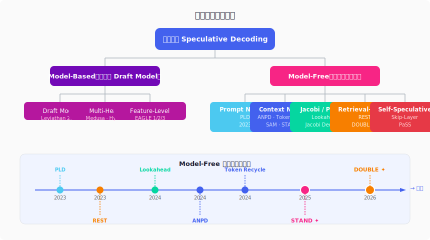
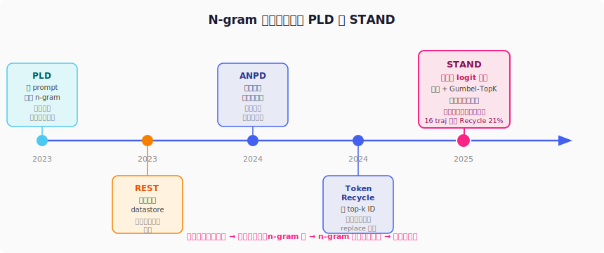
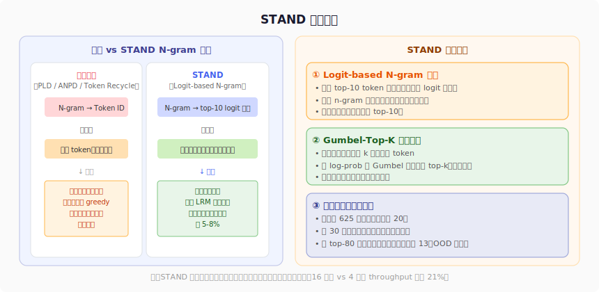
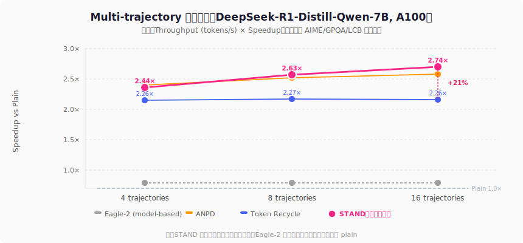
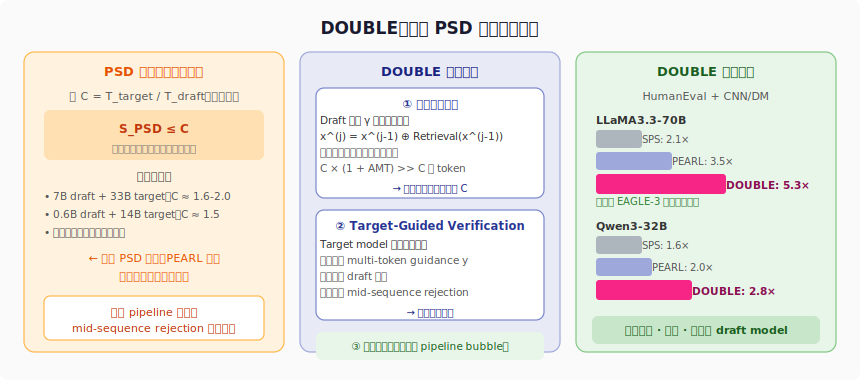

投机解码需要一个专门训练的草稿模型？并不是。本文梳理 model-free 投机解码的完整脉络，从 PLD 到 STAND 再到 DOUBLE，解析如何在不引入任何额外模型的前提下大幅加速 LLM 推理。

<!-- more -->

## 投机解码回顾

在  中介绍了 EAGLE 系列，它的核心是用一个轻量的 Draft Model 代替 N 层 Transformer。但维护一个 Draft Model 有其代价：

- 每次升级 target model（如 Llama 3.1 → 3.3），draft model 需要**重新训练**
- 部署时需要同时管理两个模型
- Draft model 的参数量决定了接受率的天花板

本文的问题是：**能否完全不用 draft model，只靠 target model 自身加速推理？**

答案是可以。这类方法统称 **Model-Free 投机解码**。

---

## 方法全景



Model-free 方法的核心思路是：利用语言模型输出中固有的**冗余性**来构造草稿 token，而不需要学一个专门的 draft model。

主要分为四条技术路线：

| 路线 | 核心思想 | 代表方法 |
|------|---------|---------|
| N-gram 查找 | 复用历史生成的 n-gram 序列 | PLD, ANPD, Token Recycle, SAM, STAND |
| Jacobi 并行 | 迭代更新多个位置的 token | Jacobi Decoding, Lookahead |
| 检索增强 | 检索外部数据库中的相似续写 | REST, DOUBLE |
| 自投机 | 跳层/多头预测 | PaSS, SuffixDecoding |

---

## N-gram 方法演进

N-gram 方法是目前最主流的 model-free 路线，五年间经历了清晰的演进。



### PLD：从 Prompt 中复用

**论文**：Saxena, 2023

最朴素的思路：如果当前生成的上下文在 prompt 中出现过，那么 prompt 里那段话的后续可以直接当草稿。

```
Prompt: "The quick brown fox jumps over the lazy dog."
当前已生成: "The quick brown"
草稿: "fox jumps over the lazy dog."（直接从 prompt 复制）
```

适合摘要、RAG、代码补全这类需要大量复述输入的任务。代价是只能复用 prompt 内容，一旦模型开始自由生成就失效了。

### ANPD：动态 N-gram 表

**论文**：Ou et al., 2024 (arXiv:2404.08698)

把查找范围从 prompt 扩展到**已生成的全部上下文**，并维护一张动态更新的 1-gram 到 4-gram 查找表。按长度降序匹配，优先用更长的 n-gram。

改进很直接，但仍是**确定性起草**（greedy 选 n-gram 对应的下一个 token）。

实验数据（DeepSeek-R1-Distill-Qwen-7B, AIME-2024, 16 trajectories）：
- Throughput: 52.04 tokens/s（**x1.82** vs plain）
- 平均接受长度: 2.01

### Token Recycle：存 top-k token ID

**论文**：Luo et al., 2024 (arXiv:2408.08696)

在 target model 推理时顺便保存 **top-k token ID**，下次遇到相同 n-gram 上下文时直接复用——这是零额外计算的"顺手保存"策略。

相比 ANPD 保留了部分概率信息（知道哪些 token 概率高），效果有明显提升。

实验数据（同上）：
- Throughput: 64.48 tokens/s（**x2.26** vs plain）
- 平均接受长度: 2.75

但 Token Recycle 的查找表使用 **replace 策略**：新遇到的 n-gram 直接覆盖旧记录。这意味着无法聚合多条轨迹的历史信息——性能在 4 条轨迹时就基本饱和，不随轨迹数增加而提升。

### SAM Decoding：后缀自动机

**论文**：Hu et al., 2024 (arXiv:2411.10666)

用后缀自动机（suffix automaton）管理 n-gram 查找，支持高效的在线更新和精确匹配。工程上比 hash table 更优雅，尤其在长序列下。

单独使用 SAM 效果与 ANPD 相近；与 Token Recycle 组合（SAM+Recycle）有小幅提升，但瓶颈仍在确定性起草本身。

### STAND：存 logit 分布 + 随机起草

**论文**：Song et al., 2025 (arXiv:2506.04708)，KAIST & Amazon AGI

这是本文重点解析的方法。

---

## STAND：随机性是关键

### 核心观察：LRM 推理轨迹高度冗余

STAND 的出发点来自一个实验观察。作者分析了 DeepSeek-R1-Distill-Qwen-7B 在 AIME-2024 上生成的多条推理轨迹，统计 n-gram 的重叠率：

| N-gram 类型 | 2 条轨迹 | 8 条轨迹 | 16 条轨迹 |
|------------|---------|---------|---------|
| Bigram (2-gram) | **>90%** | ~95% | ~97% |
| 4-gram | ~60% | ~75% | ~80% |

16 条轨迹中有 97% 的 bigram 是重复的。这不是巧合——推理模型在探索不同解题思路时，大量使用相同的逻辑短语、数学表达式和推理模式（"Let me consider...", "Therefore...", "Since x = ..."）。

**这种冗余是 model-free 起草的直接机会。**

### 随机 vs 确定性起草

但光有冗余还不够。现有方法（PLD、ANPD、SAM）都是确定性起草：n-gram 查到了就输出对应的固定 token。

LRM 的问题在于它使用采样（temperature > 0）生成多样化轨迹。对一个采样场景，确定性草稿意味着每次 draft token 的概率 q(x_draft) = 1。在投机解码的验证公式中：

$$\alpha_i = \min\left(1, \frac{p(x_i)}{q(x_i)}\right)$$

当 q = 1（确定性草稿）且 p(x_draft) 较小时，接受率很低。

**随机起草**则对齐 target model 的采样分布，p 和 q 更接近，接受率天然更高。

作者实验验证了这一点：

| 起草方式 | AIME 接受率 | GPQA 接受率 | LiveCodeBench 接受率 |
|---------|-----------|-----------|-------------------|
| 确定性 | ~60% | ~64% | ~63% |
| 随机 | **~65%** | **~71%** | **~71%** |

随机起草在三个任务上分别提升 **5%, 7%, 8%** 的接受率。

### STAND 方法



STAND（**ST**ochastic **A**daptive **N**-gram **D**rafting）包含三个设计：

#### 1. Logit-based N-gram 模块

传统 N-gram 模块：存 `n-gram → token ID`（确定性）

STAND：存 `n-gram → top-10 logit 分布`（随机）

具体地，对词表大小 V，只保留 top-10 个 token 及其对应概率。相同 n-gram 多次出现时，加权平均合并分布：

$$\text{dist}_{t+1} = \frac{k}{k+1} \cdot \text{dist}_t + \frac{1}{k+1} \cdot \text{new\_dist}$$

这使得同一 n-gram 被观测的次数越多，概率估计越准确——**多跑一条轨迹，草稿就更精准一分**。内存开销恒定（每个 n-gram 只存 top-10 条目）。

#### 2. Gumbel-Top-K 并行采样

Tree-based 投机解码的每个节点需要扩展 k 个不重复子节点（即无放回采样 k 个 token）。传统做法是顺序采样，慢。

STAND 用 **Gumbel-Top-K trick**（Kool et al., 2019）并行实现：

$$\phi'_i = \phi_i - \log(-\log U_i), \quad U_i \sim \text{Uniform}(0, 1)$$

对所有候选 token 的 log-prob 加 Gumbel 噪声，取 top-k 即为等价的无放回采样。此外，Gumbel 噪声预计算并缓存，耗尽后刷新，彻底消除实时采样延迟。

对比实验：
- 随机起草（无 Gumbel-Top-K）：平均接受长度 3.24
- 随机起草（有 Gumbel-Top-K）：平均接受长度 3.30，**throughput 额外提升 6.5%**

#### 3. 数据驱动的草稿树优化

树结构决定了每步生成几个候选、扩展几层——直接影响效率和接受率的平衡。

STAND 的做法：

1. 用启发式规则初始化一棵大树（625 节点，深度 20）
2. 在 30 条真实数据上跑一遍投机解码，追踪每个节点的实际接受率
3. 选取接受率最高的 80 个节点，重组为紧凑树

结果：
- AIME throughput：启发式树 59.96 → 优化树 **64.99**（+8.4%）
- GPQA（OOD 数据）：启发式树 77.32 → 优化树 **83.47**（+7.9%）

优化树的形态很有意思：最深达 **13 层**（vs Token Recycle 启发式树的 7 层），并有细长的"尾巴"（深度 8-13 的单节点路径）。这对应了某些确定性的、高概率的推理片段——在多条轨迹中反复出现的固定表达。

### 实验结果



在 DeepSeek-R1-Distill-Qwen-7B 上，A100 单卡：

**Multi-trajectory 解码（16 条轨迹）**

| 方法 | AIME Throughput | GPQA Throughput | Avg Speedup | 平均接受长度 |
|------|---------------|---------------|------------|------------|
| Plain | 26.63 | 31.34 | 1.00× | — |
| Eagle-2 (model-based) | 29.91 | 31.69 | 1.04× | 2.11 |
| PLD | 46.60 | 46.02 | 1.70× | — |
| ANPD | 47.06 | 46.02 | 1.82× | 1.96 |
| Token Recycle | 60.86 | 69.85 | 2.26× | 2.75 |
| **STAND** | **69.15** | **91.17** | **2.74×** | **3.67** |

关键结论：
- **Token Recycle 在 4→16 轨迹几乎无增益**（replace 策略不聚合历史）
- **STAND 持续受益**：4 轨迹 x2.44，16 轨迹 x2.74（领先 Recycle +21%）
- Eagle-2 在长上下文（32k token）推理链下接受长度明显下降，x1.04 近乎无加速

此外 STAND 在 **batch decoding** 和 **test-time tree search（DVTS）** 场景下同样领先：

- Batch Size=4，7B：STAND 128.10 tokens/s（x1.42）vs Recycle 92.82（x1.03，batch 下甚至退化）
- DVTS：STAND x2.54 vs Recycle x2.14

STAND 不需要任何额外模型训练，适用于任意 LLM，且不改变输出分布（lossless）。

---

## Lookahead Decoding：Jacobi 并行路线

**论文**：Fu et al., 2024 (arXiv:2402.02057)，ICML 2024

N-gram 方法之外，另一条 model-free 路线来自 Jacobi 迭代思想。

### 核心思路

标准自回归解码是串行的：每个位置必须等前一个位置生成完才能继续。能否把它变成并行方程组求解？

Jacobi Decoding（Santilli et al., 2023）的思路：初始化一个长度为 n 的猜测序列（如全部填 [MASK]），然后迭代更新——每一步对所有位置**并行**做 forward，直到收敛。

**Lookahead Decoding** 的工程实现把过程拆成两个并行分支：

```
Lookahead Branch：每步猜测未来 n 个位置的 token（并行 forward）
Verification Branch：检查之前的猜测是否构成合法 n-gram
```

每轮一次 forward pass，同时推进猜测和验证。

效果：MT-bench 约 **1.8×**，代码生成（多 GPU）约 **4×**。无需训练，无需数据存储。

局限：对语义不确定性高的位置效果差（因为猜测错误会被丢弃），加速比相对保守。

---

## REST：检索路线

**论文**：He et al., 2023 (arXiv:2311.08252)，NAACL 2024

思路直接：维护一个外部文档的 token 数据库，推理时检索与当前上下文匹配的 n-gram，把后续 token 作为草稿。

效果（7B/13B，MT-bench/HumanEval）：1.62×-2.36×。

适合有固定知识域（文档已知）的场景；对 open-domain 任务需要提前构建 datastore。

---

## DOUBLE：突破理论加速上限

**论文**：Shen et al., 2026 (arXiv:2601.05524)，浙江大学等



### PSD 的天花板

前面讨论的方法都属于单轮投机解码（SD）：draft → verify → draft → ...。为了进一步并行，Parallel Speculative Decoding（PSD，如 PEARL）将 draft 和 verify 重叠执行。

但 PSD 存在一个**理论速度上限**：

$$S_{\text{PSD}} \leq C = \frac{T_{\text{target}}}{T_{\text{draft}}}$$

其中 C 是 target model 和 draft model 的单 token 生成时间之比。即使接受率达到 100%，PSD 的加速比也不能超过 C。

实际中 C 约为 1.5-5，对 retrieval-based 方法尤为受限（draft side 用 retrieval 速度很快但精度不够，target side 用 retrieval 精度高但慢）。

### DOUBLE 的突破

DOUBLE（**D**ouble Retrieval Speculative Parallelism）通过两个机制突破这一上限：

**① 迭代检索起草（打破上限）**

Draft model 不是生成 C 个 token，而是执行 γ 次检索迭代。每次把上一步检索到的词追加到上下文，再继续检索：

$$\mathcal{R}_j = \text{Retrieval}(\mathbf{x}^{(j-1)}, d), \quad \mathbf{x}^{(j)} = \mathbf{x}^{(j-1)} \oplus \mathcal{R}_j$$

如果每步平均匹配长度（AMT）> 0，总草稿长度 $L_{\text{draft}} \approx C \times (1 + \text{AMT}) \gg C$，突破速度比上限。

**② Target-Guided Verification（减少浪费）**

Mid-sequence rejection 是 PSD 的主要问题：draft 序列中间某个 token 被拒绝，后面的 token 全部浪费。

DOUBLE 让 target model 额外做一次单步检索，生成 multi-token guidance $y$，辅助 draft 序列的验证，大幅减少中途拒绝。

**③ 同步并行执行**

draft 和 target 的操作完全并行（draft 第 k 轮检索时，target 同步验证第 k-1 轮），消除互相等待的 pipeline bubble。

### 实验结果

在 HumanEval + CNN/DM 上（训练无关，无损）：

| 方法 | LLaMA3.3-70B | Qwen3-32B |
|------|-------------|----------|
| SPS（标准投机解码） | 2.1× | 1.6× |
| PEARL（PSD） | 3.5× | 2.0× |
| EAGLE-3（需训练） | ~4.5× | ~2.5× |
| **DOUBLE** | **5.3×** | **2.8×** |

DOUBLE 在不需要任何训练的前提下，超越了需要大量训练的 EAGLE-3。

---

## 横向对比

| 方法 | 是否需要训练 | 是否需要 Draft Model | 加速比（7B 量级） | 多轨迹收益 | 主要局限 |
|------|-----------|------------------|--------------|---------|--------|
| PLD | 否 | 否 | ~1.5× | 否 | 仅限复述任务 |
| Lookahead | 否 | 否 | ~1.8× | 有限 | 接受率低 |
| ANPD | 否 | 否 | ~1.8× | 有 | 确定性起草 |
| REST | 否（需构建 datastore） | 否 | ~2.0× | 有限 | 需要外部数据 |
| Token Recycle | 否 | 否 | ~2.3× | 几乎无 | replace 策略不聚合 |
| **STAND** | **否** | **否** | **~2.7×** | **显著（+21%）** | **Python 实现开销** |
| **DOUBLE** | **否** | **否** | **5.3×（70B）** | **有** | **需要 datastore** |
| EAGLE-3 | **需要** | **需要** | ~5.6×（13B） | 有限 | 绑定 target model |

---

## 与 Test-Time Scaling 的关系

2025 年以来，test-time compute scaling 成为提升 LRM 推理准确率的主流范式：

- **Best-of-N**：生成 N 条独立轨迹，取最好的
- **DVTS（Diverse Verifier Tree Search）**：树搜索生成多样化步骤

这些方法的共同特点是需要生成**多条长推理链**——这与 model-free SD 的多轨迹场景天然契合。

STAND 的定位非常清晰：专为 LRM 多轨迹推理优化的 model-free SD，轨迹越多，n-gram 库越精准，加速越明显。

在 16 条轨迹 + DVTS 场景下，STAND 将总解码时间降低 **60-65%**，同时保持准确率不变——这意味着用相同的 GPU 时间可以多跑 2.5 倍的推理路径，对 test-time scaling 的实际价值非常大。

---

## 小结

Model-free 投机解码的核心演进逻辑：

1. **PLD**（2023）：从 prompt 直接查 n-gram，最简单
2. **ANPD/SAM**（2024）：查已生成上下文，动态 n-gram 表
3. **Token Recycle**（2024）：存 top-k token，引入部分概率信息
4. **STAND**（2025）：存完整 logit 分布 + 随机起草 + 数据驱动树优化，多轨迹聚合越来越准
5. **DOUBLE**（2026）：双侧检索 + 迭代起草，从理论上突破 PSD 加速上限

相比 EAGLE 三部曲需要精心设计 draft model 并反复训练，model-free 方法的魅力在于**零额外模型成本、即插即用、持续受益于推理轨迹积累**。尤其在 LRM 多轨迹推理场景下，STAND 的随机起草 + 分布聚合机制让它成为目前无训练方法中的最优选择。

---

## 参考文献

- Leviathan et al., 2023. *Fast inference from transformers via speculative decoding*. ICML 2023.
- Chen et al., 2023. *Accelerating large language model decoding with speculative sampling*. arXiv:2302.01318.
- Saxena, 2023. *Prompt lookup decoding*. arXiv:2310.01558.
- He et al., 2023. *REST: Retrieval-Based Speculative Decoding*. NAACL 2024. arXiv:2311.08252.
- Fu et al., 2024. *Break the Sequential Dependency of LLM Inference Using Lookahead Decoding*. ICML 2024. arXiv:2402.02057.
- Cai et al., 2024. *Medusa: Simple LLM Inference Acceleration Framework with Multiple Decoding Heads*. ICML 2024. arXiv:2401.10774.
- Ou et al., 2024. *Lossless Acceleration of LLM via Adaptive N-gram Parallel Decoding*. arXiv:2404.08698.
- Luo et al., 2024. *Turning Trash into Treasure: Accelerating Inference of Large Language Models with Token Recycling*. arXiv:2408.08696.
- Hu et al., 2024. *SAM Decoding: Speculative Decoding via Suffix Automaton*. arXiv:2411.10666.
- Oliaro et al., 2024. *SuffixDecoding: A Model-Free Approach to Speeding Up Large Language Model Inference*. arXiv:2411.04975.
- Li et al., 2024. *EAGLE: Speculative Sampling Requires Rethinking Feature Uncertainty*. arXiv:2401.15077.
- Li et al., 2024. *EAGLE-2: Faster Inference of Language Models with Dynamic Draft Trees*. arXiv:2406.16858.
- Song et al., 2025. *Accelerated Test-Time Scaling with Model-Free Speculative Sampling (STAND)*. arXiv:2506.04708.
- Shen et al., 2026. *DOUBLE: Breaking the Acceleration Limit via Double Retrieval Speculative Parallelism*. arXiv:2601.05524.
- Xia et al., 2024. *Unlocking Efficiency in Large Language Model Inference: A Comprehensive Survey of Speculative Decoding*. ACL 2024 Findings.
- Kool et al., 2019. *Stochastic Beams and Where to Find Them: The Gumbel-Top-K Trick*. ICML 2019.
