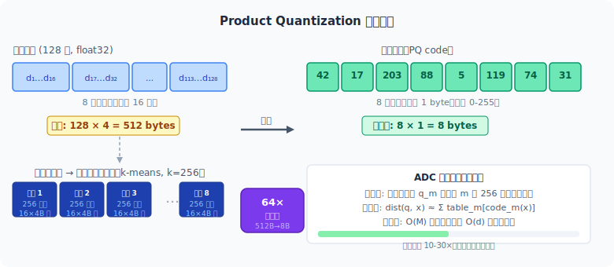
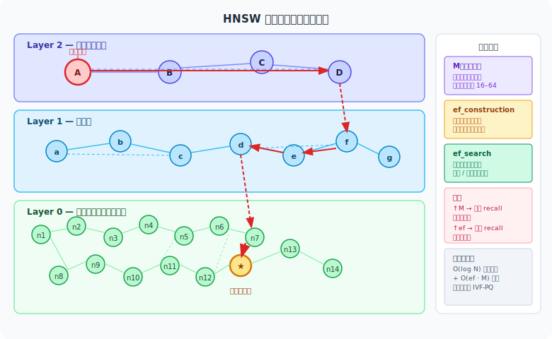
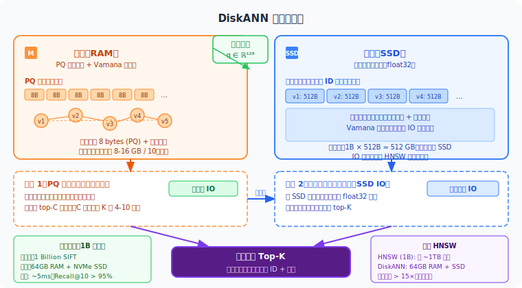

向量检索要解决的问题只有一个：给定查询向量 $q$，从 $N$ 个向量里找出最相似的那几个。但当 $N$ 到了一亿、维度到了 1024，暴力扫描根本跑不动，精确的树结构索引在高维空间又失效了——**怎样在不扫描所有向量的前提下找到足够准确的最近邻？** 这个问题驱动了向量检索领域十几年的演进。

<!-- more -->

## 问题的本质：维度灾难与精确检索的瓶颈

先把问题的规模感建立起来。

假设你有 1 亿个 1024 维的 float32 向量——这在当前的语义搜索场景里完全不算夸张，一个中等规模的文档库就能到这个量级。存储这些向量需要：

$$1 \times 10^8 \times 1024 \times 4 \text{ bytes} = 400 \text{ GB}$$

如果要对每个查询做精确最近邻搜索（Exact Nearest Neighbor, ENN），需要计算查询向量和所有 $N$ 个向量的距离，时间复杂度是 $O(N \cdot d)$。对一个查询，这意味着要做 $10^8 \times 1024 \approx 10^{11}$ 次浮点运算。就算硬件能跑 $10^{12}$ FLOPS，这一次查询也要 0.1 秒——对一个需要低延迟的在线服务来说完全不可接受，而且这还是单核的理想情况。

**kd-tree 的幻灭**。低维空间里，kd-tree 是最经典的近邻索引结构：它每次选一个维度，以中位值为分界线把数据集一分为二，递归下去形成一棵二叉树。查询时，沿着树向下走，只搜索查询点所在的那半边，剪掉另一半，理论复杂度 $O(d \cdot N^{1-1/d})$ 远优于线性扫描。在二维或三维，这个加速效果显著。但随着维度 $d$ 增大，指数 $1-1/d$ 趋近于 1，kd-tree 的优势迅速消失。当 $d > 20$，kd-tree 的性能几乎退化到和暴力扫描一样，这就是"维度灾难"的具体表现：高维空间里，所有点彼此之间的距离都差不多，"剪掉另一半"能剪掉的越来越少，树结构的优势荡然无存。

面对这个局面，研究者做出了一个根本性的妥协：**放弃精确性，换取速度**。近似最近邻（Approximate Nearest Neighbor, ANN）搜索用 recall 来衡量准确性——即返回结果中真实最近邻的比例。工程实践中，recall@10 达到 95% 以上通常已经足够，用户感知不到这 5% 的差异。这个权衡打开了一整个方法论空间。

---

## Product Quantization：第一把向量压缩的钥匙

> 论文：[Product quantization for nearest neighbor search](https://ieeexplore.ieee.org/document/5432202)（Jégou et al.，IEEE TPAMI 2011）

2011 年，Jégou 等人提出了 [Product Quantization（PQ）](https://ieeexplore.ieee.org/document/5432202)，这是向量检索领域最重要的早期突破之一。它的核心直觉非常朴素：**既然我们存不下所有向量，就把向量压缩存储**。

### 切分与量化

PQ 的做法分三步。

第一步，把一个 $d$ 维向量切成 $M$ 段等长的子向量，每段长度为 $d/M$。例如 128 维向量切成 8 段，每段 16 维。

第二步，对每段子向量独立做 k-means 聚类，得到 $k=256$ 个聚类中心（码本，codebook）。注意 256 是精心选择的——它恰好能用 1 个 byte（uint8）来表示索引。

第三步，用每段子向量在对应码本中最近聚类中心的 ID 来代替原始浮点数。128 维向量由此被压缩成 8 个 byte。

这个压缩比是非常惊人的：原始 128 维 float32 向量占 512 bytes，压缩后只需 8 bytes，**压缩 64 倍**。1 亿个向量的存储从 400 GB 降到了 800 MB，可以轻松放进内存。

### 查表加速距离计算

压缩带来的不只是存储收益，距离计算也同样加速了。

对一个查询向量 $q$，在执行搜索前，先把 $q$ 也切成 $M$ 段，对每段子向量 $q_m$，预先计算它与码本 $m$ 中 256 个中心的距离，得到 $M$ 张距离表，每张大小为 $256$。这一步的代价是 $M \times 256 \times (d/M) = 256 \times d$ 次浮点运算，只需一次。

之后，对数据库中任意一个被压缩的向量 $x$（由 $M$ 个码字组成），近似距离变成：

$$\hat{d}(q, x) = \sum_{m=1}^{M} \text{table}_m[\text{code}_m(x)]$$

每次查询只需要 $M$ 次查表和加法，而不再是 $d$ 次浮点乘法。对于 128 维向量（$M=8$，$d=128$），理论加速比约为 $128/8 = 16$ 倍，实测中由于 cache 友好性，加速比可以更高。这套方法称为 Asymmetric Distance Computation（ADC）。

### IVFADC：加一层倒排索引

只有 PQ 还不够——它压缩了向量，但搜索时仍然需要扫描所有压缩向量，复杂度仍是 $O(N)$。解法是在 PQ 之上加一层 Inverted File Index（IVF）。

训练时，先用 k-means 把全量向量聚成 $K$ 个大的 Voronoi 分区（通常 $K$ 取几千到几万）。每个向量被分配到最近的分区中心，只存在那个分区的倒排列表里。查询时，先找到查询向量最近的 $n_{\text{probe}}$ 个分区，只在这几个分区里做 PQ 距离计算。这样一来，有效扫描的向量数从 $N$ 降到约 $N \times n_{\text{probe}} / K$，再大的数据集也可以控制在可接受的范围内。

PQ 的局限也是实实在在的。聚类是离线批量计算的，向量库有增删时需要重建索引。切分子向量的方式会影响 recall，如果不同维度之间相关性很强，均匀切分可能并不是最优的。更根本的是，PQ 量化的目标是最小化重建误差，而不是最小化检索排名错误——这个问题后来被 ScaNN 专门针对性地解决了。

---

## 图索引的崛起：从 NSW 到 HNSW

PQ 的路数是"压缩存储 + 分区索引"，另一条完全不同的路径是把向量组织成一张图，让搜索变成在图上的贪心游走。

### NSW：导航小世界

> 论文：[Approximate nearest neighbor algorithm based on navigable small world graphs](https://www.sciencedirect.com/science/article/pii/S0306437913001300)（Malkov et al.，Information Systems 2014）

2014 年，Malkov 等人提出了 [Navigable Small World（NSW）图索引](https://www.sciencedirect.com/science/article/pii/S0306437913001300)。构建时，每个向量节点被连接到 $M$ 个最近邻节点上。搜索时，从某个入口节点出发，每一步贪心地跳到当前最近邻节点中离查询最近的那个，直到无法改善为止。

这个想法的直觉来自社交网络中的"六度分隔"——通过几次跳跃就能从图中任意一点到达另一点。在向量空间里，如果图结构足够好，贪心搜索就能快速收敛到真实最近邻附近。

NSW 的问题有两个。第一，整张图只有一层，短程边用于精细定位，长程边用于快速跳跃，但两者混在同一层上，早期搜索效率不高。第二，搜索从一个固定的入口节点出发，入口节点的位置好坏会显著影响结果质量。

### HNSW：把图分层

> 论文：[Efficient and robust approximate nearest neighbor search using hierarchical navigable small world graphs](https://arxiv.org/abs/1603.09320)（Malkov & Yashunin，IEEE TPAMI 2020）

2016 年（期刊版 2018 年），Malkov 和 Yashunin 提出了 [Hierarchical Navigable Small World（HNSW）](https://arxiv.org/abs/1603.09320)，用一个优雅的想法解决了 NSW 的根本问题：**把图分成多层，上层稀疏（负责长距离跳跃），下层密集（负责精细定位）**。

**构建过程**：插入一个新节点时，随机赋予它一个最高层级 $l$，概率服从指数衰减分布 $P(l = k) \propto e^{-k/m_L}$，这使得绝大多数节点只存在于底层（layer 0），极少数节点存在于高层。在每一层，节点维护 $M$ 个到最近邻的连接。

**搜索过程**：从最高层的入口节点开始，在当前层贪心下降到局部最优，然后把找到的最优节点作为下一层的入口，重复这个过程，直到在 layer 0 完成精细搜索，返回前 $K$ 个结果。

三个核心参数控制着 HNSW 的行为：

- **M**：每层每节点保留的近邻连接数，典型值 16–64。M 越大，recall 越高，但内存和构建时间也越大。
- **ef\_construction**：构建时维护的动态候选集大小，影响构建质量，通常设为 100–400。
- **ef\_search**：查询时的候选集大小，是运行时的精度-速度调节旋钮，可以不重建索引直接调整。

HNSW 在 recall/speed tradeoff 曲线上碾压了 IVF-based 方法，迅速成为工程上的首选。当你在各种向量数据库里看到默认推荐用 HNSW 时，背后就是这个原因。

但 HNSW 有一个致命弱点，而且是结构性的：图必须全量加载到内存中才能使用。每个节点除了向量本身，还需要存储 $M$ 个邻居指针。1 亿个 128 维 float32 向量的 HNSW 索引，内存占用通常在 50–100 GB 量级。亿级别的场景往往需要数百 GB 甚至 TB 级内存，这在大多数机器上根本不现实。

---

## Faiss：把 IVF+PQ 做成工业级工具

> 论文：[Billion-scale similarity search with GPUs](https://arxiv.org/abs/1702.08734)（Johnson et al.，IEEE Transactions on Big Data 2019）

2017 年，Facebook AI Research（现 Meta FAIR）发布了 [Faiss（Facebook AI Similarity Search）](https://arxiv.org/abs/1702.08734)，它不是一个全新的算法，而是把 IVF、PQ、HNSW 等已有方法系统地工程化，并引入了 GPU 加速支持。

Faiss 的设计哲学是"提供积木，而不是黑盒"。它把各种索引结构解耦成可组合的模块，让工程师根据场景自由搭配。最常用的 `IndexIVFPQ` 组合了 IVF 分区和 PQ 压缩，核心参数有：

- **nlist**：IVF 的分区数，通常取 $4\sqrt{N}$ 到 $16\sqrt{N}$，1 亿向量对应约 4000–16000 个分区
- **nprobe**：查询时搜索的分区数，是最主要的精度-速度权衡旋钮。nprobe 增大，recall 上升，延迟也上升
- **M（PQ 子段数）** 和 **nbits（每段位数，通常 8）**：控制向量压缩率和量化精度

Faiss 的 GPU 版本（`faiss-gpu`）在 flat 和 IVF 索引上能实现极高的吞吐，特别适合离线批量检索或对延迟要求不极端的在线服务。它的出现极大降低了工业界上线 ANN 系统的门槛，成为这个领域的基础设施层。

从选型的实践规律来看，如果你的数据集小于 100 万条，直接用 HNSW（Faiss 的 `IndexHNSWFlat`），精度高，延迟低，内存通常能接受。超过 100 万条，就需要在 HNSW（内存贵）和 IVF-PQ（内存省但 recall 低一些）之间权衡。这个三角形——内存、精度、速度——没有银弹，只有针对具体场景的取舍。

---

## ScaNN：重新思考量化的损失函数

> 论文：[Accelerating large-scale inference with anisotropic vector quantization](https://arxiv.org/abs/1908.10396)（Guo et al.，ICML 2020）

2020 年，Google Research 提出了 [ScaNN（Scalable Approximate Nearest Neighbor）](https://arxiv.org/abs/1908.10396)，它的出发点是对 PQ 做了一个根本性的反问：**PQ 优化的目标对吗？**

PQ 的训练目标是最小化向量重建误差——让量化后的向量尽量靠近原始向量。这个目标在几何上很自然，但对检索任务来说，重建误差小并不等价于检索排名正确。你真正在乎的是：量化后，查询向量 $q$ 与候选向量 $x$ 的距离排名有没有被搞乱？

### 各向异性量化损失

ScaNN 提出了"各向异性量化损失"（Anisotropic Quantization Loss）。关键洞察是：在内积空间里，量化误差对排名的影响是各向异性的。

设向量 $x$ 的量化误差为 $\delta = \tilde{x} - x$（$\tilde{x}$ 是量化后的向量）。$\delta$ 可以分解为平行于 $x$ 方向的分量 $\delta_\parallel$ 和垂直于 $x$ 的分量 $\delta_\perp$。内积 $\langle q, x \rangle$ 的近似误差主要取决于 $\delta_\parallel$（沿 $x$ 方向的误差直接影响内积值），而 $\delta_\perp$ 对内积几乎没有影响。

因此，ScaNN 的量化目标是：

$$\mathcal{L}(\tilde{x}) = \lambda \|\delta_\parallel\|^2 + \|\delta_\perp\|^2, \quad \lambda \gg 1$$

通过对平行分量施加更大的惩罚权重 $\lambda$，迫使量化器在"不影响检索排名的方向"上允许更大误差，把量化精度集中到真正重要的方向上。

这个目标不再是最小化欧氏重建误差，而是直接面向"减少因量化导致的排名错误"来训练码本。在 Google 内部的搜索系统上，ScaNN 比性能相当的 HNSW 快了 2 倍以上，在公开数据集的 recall@10 指标上也常常排第一。

代价是量化训练过程更复杂，需要调整各向异性权重 $\lambda$，对不同数据分布的敏感性也更高。对于大多数工程团队来说，直接用 HNSW 或 IVF-PQ 再调参，性价比往往更高；ScaNN 更适合那些对延迟有极限要求、并且有资源做精细调优的大规模系统。

---

## DiskANN：当索引大到装不进内存

> 论文：[DiskANN: Fast accurate billion-point nearest neighbor search on a single node](https://proceedings.neurips.cc/paper/2019/hash/09853c7fb1d3f8ee67a61b6bf4a7f8e6-Abstract.html)（Subramanya et al.，NeurIPS 2019）

HNSW 的内存问题一直如影随形。2019 年，微软研究院的 Subramanya 等人提出了 [DiskANN](https://proceedings.neurips.cc/paper/2019/hash/09853c7fb1d3f8ee67a61b6bf4a7f8e6-Abstract.html)，正面挑战这个问题。他们的答案是：**把图存在磁盘上，内存只放 PQ 压缩版**。

这个想法听起来简单，但实现起来有一个核心困难：图搜索天然是随机访问密集型的——在图上游走意味着不断根据邻居 ID 跳跃到随机位置读取数据。SSD 的随机 IO 延迟大约是 100 微秒量级，一次搜索要游走几十到几百次，全走磁盘的延迟是不可接受的。

### 两阶段搜索

DiskANN 的解法是把一次搜索切成两个阶段。

**阶段一（纯内存，零磁盘 IO）**：用内存中存储的 PQ 压缩图做快速贪心搜索。由于向量已经被压缩到每个只有 8–16 bytes，整张压缩图可以放进 16–32 GB 的内存（1 亿个向量）。这一阶段快速筛选出 top-C 的候选集，C 是最终所需 K 的 4–10 倍。PQ 的近似距离在这里只用于剪枝，不需要很精确。

**阶段二（少量 SSD IO）**：只对阶段一筛出的候选向量，从 SSD 上读取原始 float32 向量，计算精确距离，做重排序，返回真实的 top-K。

这里的关键是：需要读 SSD 的向量数量从 $N$（全量）降到了 $C$（候选集），通常只有几百到几千条，SSD IO 量级完全可控。

### Vamana 图的设计

DiskANN 没有直接用 HNSW 的图，而是引入了专为磁盘访问设计的 Vamana 图构建算法。Vamana 的关键优化是在构建时刻意引入更多的"长程边"——连接图中距离较远的节点。这样在搜索时，每次 IO 读取一个节点的邻居，能跳跃的距离更大，总 IO 次数更少。HNSW 的分层结构在磁盘访问场景下并无优势，而 Vamana 的单层图 + 长程边设计在随机 IO 次数上更优。

每个 SSD 页面上存储节点的完整向量加上它的邻居列表，尽量让一次 IO 能读到搜索所需的全部信息，减少随机跳跃。

**实测结果**：在 10 亿个 SIFT 128 维向量的数据集上，一台配备 64 GB RAM 和普通 NVMe SSD 的服务器，可以在 5 毫秒内完成单次查询，recall@10 超过 95%。相比之下，HNSW 要达到同样的 recall 和延迟，需要超过 1 TB 的内存。

DiskANN 的意义在于重新定义了"亿级向量检索"的硬件门槛。在此之前，这件事意味着需要昂贵的大内存专用服务器；之后，一台普通的云主机就可以做到。对于没有超大规模基础设施的团队来说，这是一个质变。

---

## 现代向量数据库的工程挑战

有了好的索引算法，真正落地还有一系列工程问题需要解决。

**动态增删**是首要挑战。HNSW 支持增量插入，但删除需要标记加懒惰清理，频繁删除后图质量会下降，需要周期性重建。IVF 类方法的增量插入也会破坏 Voronoi 分区，需要定期重新训练。这个问题目前没有完美的解法，各家向量数据库都有自己的 workaround。

**带过滤条件的搜索**（metadata filter）在实践中非常常见：找到"距离 $q$ 最近的，且属于类别 A 的向量"。简单的做法是先 ANN 再 post-filter，但如果过滤条件很严格（只有 1% 的向量满足），候选集里能通过过滤的太少，recall 会严重下降。更好的方案是把过滤条件整合进搜索过程（如 Milvus 的 filtered HNSW），但实现复杂度大幅上升。

**分布式扩展**：数据量超过单机极限时，需要把索引分片到多台机器上。分片策略会影响搜索精度和路由延迟，各家方案不尽相同。

主流向量数据库（Milvus、Weaviate、Pinecone、Qdrant）在底层索引上大体都使用 HNSW 或 IVF-PQ，差异更多在存储引擎、分布式架构、过滤查询的实现方式，以及是否支持 DiskANN 类的磁盘索引。

从实践选型的角度，一个粗糙但有用的经验规律是：

| 数据规模 | 内存充裕 | 内存紧张 |
|:---|:---|:---|
| < 100 万 | HNSW（精度最高） | IVF-Flat 或 IVF-PQ |
| 100 万 – 1 亿 | HNSW（如果内存够） | IVF-PQ |
| > 1 亿 | HNSW + 分布式 | DiskANN 或 IVF-PQ + 分片 |

---

## 回望这条路

这个领域每一步向前，都是被现实的约束逼出来的。

**暴力扫描**：最准，但时间和内存都不可接受，是所有近似方法的比较基线。

**kd-tree**：在低维有效，高维退化，本质上没能逃脱维度灾难的魔咒。

**Product Quantization（2011）**：第一把钥匙。核心思路是用有损压缩换存储空间，用查表换浮点运算。代价是 recall 上限受压缩损失约束，且不支持动态更新。

**IVF + PQ（IVFADC）**：在 PQ 之上加倒排分区，把 $O(N)$ 的扫描压缩到 $O(N/K)$。nprobe 成为运行时可调的精度旋钮，但分区训练是静态的。

**NSW / HNSW（2014 / 2018）**：用图结构彻底绕开了"分区切割"的思路。分层图让搜索从 $O(N)$ 降到接近 $O(\log N)$，在 recall/speed 曲线上全面胜出。代价是内存必须装下整张图，亿级别场景几乎不现实。

**Faiss（2017）**：工程化的里程碑。把各种算法打包成可组合的积木，让工业界能用上这些研究成果。GPU 加速的 flat 和 IVF 索引对离线批量检索有决定性的加速。

**ScaNN（2020）**：指出了 PQ 优化目标的错位。量化应该对齐检索任务，而不是最小化重建误差。各向异性损失把量化精度集中到真正影响排名的方向上，但调参更复杂。

**DiskANN（2019/2021）**：用"内存放 PQ 图，磁盘放原始向量"的两阶段搜索，把亿级向量检索的内存需求从 TB 降到数十 GB。Vamana 图的设计进一步减少了磁盘 IO 次数。这个工作的意义不只是技术上的，它改变了"大规模向量检索"这件事的经济学。

这条路还在继续延伸。学习型索引（Learned Index）、向量检索与标量过滤的深度融合、在消费级 GPU 上运行亿级 HNSW——这些方向都还在活跃演进中。但核心张力始终没变：**在精度、速度、内存三角之间，找到当前硬件条件下最好的那个点**。每隔几年就会有人找到一个新的更好的点，然后整个行业往那个方向移动。

---

## 参考文献

1. Jégou, H., Douze, M., & Schmid, C. (2011). **[Product quantization for nearest neighbor search](https://ieeexplore.ieee.org/document/5432202)**. *IEEE Transactions on Pattern Analysis and Machine Intelligence*, 33(1), 117–128.

2. Malkov, Y., Ponomarenko, A., Logvinov, A., & Krylov, V. (2014). **[Approximate nearest neighbor algorithm based on navigable small world graphs](https://www.sciencedirect.com/science/article/pii/S0306437913001300)**. *Information Systems*, 45, 61–68.

3. Malkov, Y. A., & Yashunin, D. A. (2020). **[Efficient and robust approximate nearest neighbor search using hierarchical navigable small world graphs](https://arxiv.org/abs/1603.09320)**. *IEEE Transactions on Pattern Analysis and Machine Intelligence*, 42(4), 824–836.

4. Johnson, J., Douze, M., & Jégou, H. (2019). **[Billion-scale similarity search with GPUs](https://arxiv.org/abs/1702.08734)**. *IEEE Transactions on Big Data*, 7(3), 535–547.

5. Guo, R., Sun, P., Lindgren, E., Geng, Q., Simcha, D., Chern, F., & Kumar, S. (2020). **[Accelerating large-scale inference with anisotropic vector quantization](https://arxiv.org/abs/1908.10396)**. *ICML 2020*.

6. Subramanya, S. J., Devvrit, F., Kadekodi, R., Krishnaswamy, R., & Simhadri, H. V. (2019). **[DiskANN: Fast accurate billion-point nearest neighbor search on a single node](https://proceedings.neurips.cc/paper/2019/hash/09853c7fb1d3f8ee67a61b6bf4a7f8e6-Abstract.html)**. *NeurIPS 2019*.
