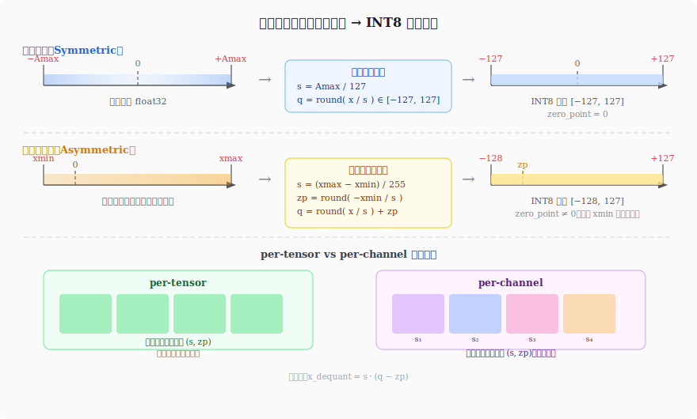
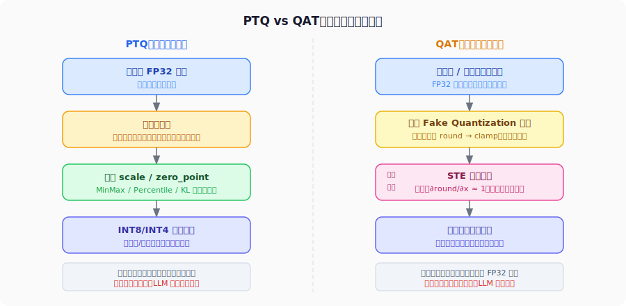
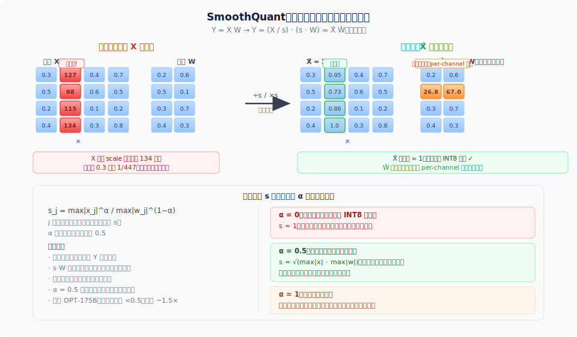

GPT-3 出来之后，175B 参数的模型光是存权重就需要 350GB 显存，旧的 INT8 量化方法照搬进来，精度直接崩掉——大模型的激活分布和卷积网络截然不同，量化这件事得重新来过。

这篇文章沿着这条路走一遍：从数字格式的基础讲起，到 GPTQ、LLM.int8()、SmoothQuant、AWQ 各自解决的问题，再到 2-bit 向量量化和 1-bit 的极端探索。

<!-- more -->

## 数字怎么存：从 float32 到 1-bit 的演进

要讲量化，得先讲清楚"数字是怎么存的"。这不是在炒冷饭，因为量化的很多设计选择，根子上就是在不同的表示格式之间做权衡。

### float32 的结构

IEEE 754 单精度浮点数用 32 位表示一个数，分成三段：

- **符号位**（1 bit）：0 表示正数，1 表示负数
- **指数位**（8 bit）：存储的是偏置后的指数 $e \in [0, 255]$，真实指数为 $e - 127$。比如 $e = 127$ 代表 $2^0 = 1$，$e = 130$ 代表 $2^3 = 8$，$e = 124$ 代表 $2^{-3} = 0.125$。指数位决定这个数的**数量级**（大概是多大）。
- **尾数位**（23 bit）：存储小数点后的二进制位，隐含一个前导的 1，即实际尾数为 $1.b_1 b_2 \ldots b_{23}$（二进制）。尾数位决定这个数在当前数量级下的**精度**（能精确到多细）。

举个例子，数字 $-0.75$：符号位为 1（负数），$0.75 = 1.1_2 \times 2^{-1}$，所以指数为 $-1 + 127 = 126$（即 `01111110`），尾数为 $10000\ldots0$（二进制 $1.1$ 的小数部分是 $1$，后面补零）。

最终值公式为 $(-1)^s \times 2^{e-127} \times (1 + \text{fraction})$。

这个设计的核心是"浮点"——指数位决定动态范围（float32 可以表示从约 $10^{-38}$ 到 $10^{38}$ 的数），尾数位决定精度（约 7 位十进制有效数字）。动态范围和精度是一对此消彼长的关系，这个矛盾在后来的格式演进中会反复出现。

### float16 vs bfloat16：一个设计权衡

把 float32 压到 16 位有两种主流方案：

| 格式 | 符号 | 指数 | 尾数 | 动态范围 | 精度 |
|------|------|------|------|----------|------|
| float16 | 1 | 5 | 10 | $\approx 10^{-4}$ 到 $10^4$ | 约 3 位十进制 |
| bfloat16 | 1 | 8 | 7 | 与 float32 相同 | 约 2 位十进制 |

bfloat16（Brain Float 16，Google 为 TPU 设计）的选择是：保留 float32 的全部 8 位指数，把尾数从 23 压到 7。这意味着动态范围与 float32 完全一致，但精度降低了。

为什么这个权衡在深度学习里有意义？因为神经网络训练中，梯度的数值范围变化剧烈——一层的梯度可能是 $10^{-6}$，另一层是 $10^2$，动态范围不够就会发生下溢（underflow）或上溢（overflow）。float16 在混合精度训练时需要 loss scaling 来缓解这个问题，bfloat16 则完全不需要。代价是尾数精度低一些，但实践证明这对大多数模型影响不大。

### 为什么不直接用 FP8？

一个自然的问题是：既然已经有 float16 和 bfloat16，下一步为什么不是 FP8（8 位浮点），而是 INT8（8 位整数）？

原因是历史和硬件的顺序问题。INT8 是更早被硬件支持的低精度格式——NVIDIA 从 Turing 架构（2018 年的 RTX 20 系列）就引入了 INT8 Tensor Core，而 FP8 要等到 Hopper 架构（2022 年的 H100）才有硬件原生支持。在此之前，FP8 在通用硬件上只能用 INT8 或 FP16 模拟，没有任何速度优势。所以 INT8 量化的大量研究和工程实践，是在 FP8 硬件出现之前就成熟起来的。

FP8 作为格式确实更优雅（保留了浮点的动态范围特性），文章后面会单独讲。INT8 则是在"FP8 硬件还不存在"的年代里，工程师们用整数运算换推理速度的主战场。

### INT8 量化：scale 和 zero_point

整数格式彻底放弃了浮点的表示方式，用线性映射把浮点值域压进整数格的离散格子里。基本公式是：

$$q = \text{round}\left(\frac{x}{s}\right) + z$$

$$x_{\text{dequant}} = s \cdot (q - z)$$

其中 $s$（scale）是步长，$z$（zero_point）是偏移量。反量化公式把整数格子还原回浮点近似值。

**对称量化**（Symmetric）令 $z = 0$，整数值域关于零对称。适合权重（通常分布关于零对称）：

$$s = \frac{\max(|x|)}{127}, \quad q = \text{round}\left(\frac{x}{s}\right) \in [-127, 127]$$

**非对称量化**（Asymmetric）允许 $z \neq 0$，整数值域可以偏移，适合 ReLU 之后的激活（值域是 $[0, +\infty)$，没必要浪费一半的整数格子）：

$$s = \frac{x_{\max} - x_{\min}}{255}, \quad z = \text{round}\left(-\frac{x_{\min}}{s}\right)$$

直觉上，对称量化就是"把数轴以零为中心折叠压缩"，非对称量化则是"先平移再压缩"，能更充分地利用整数值域。

**一个具体的例子。** 假设某层权重的值域是 $[-2.4, 2.4]$，用对称量化映射到 INT8 的 $[-127, 127]$：

$$s = \frac{2.4}{127} \approx 0.0189$$

现在有一个权重值 $x = 1.5$，量化过程是：

$$q = \text{round}\left(\frac{1.5}{0.0189}\right) = \text{round}(79.4) = 79$$

反量化（还原近似值）：

$$x_{\text{dequant}} = 0.0189 \times 79 = 1.4931$$

量化误差为 $|1.5 - 1.4931| = 0.0069$，约为原始值的 0.46%。

这个误差看起来很小，但问题在于：如果这层权重里有一个异常大的值，比如 $x = 48$，那 scale 就变成 $48/127 \approx 0.378$，这时对 $x = 1.5$ 的量化结果是 $\text{round}(1.5/0.378) = \text{round}(3.97) = 4$，反量化为 $0.378 \times 4 = 1.512$，误差反而更大——整个值域被一个异常值"拉扯"，大量普通值的精度被牺牲掉了。这正是后面 LLM 量化困难的根源。

**量化到底省了什么？** 这里有一个容易混淆的地方。上面的例子展示的是"量化存储、推理时还原"的模式——权重以 INT8 存在磁盘/显存里，推理时先反量化回浮点，再做浮点矩阵乘法。这种方式**只省显存，不省计算**，矩阵乘本身还是在跑浮点指令。

如果要同时省计算，需要让矩阵乘法本身发生在整数域——也就是权重和激活都量化成 INT8，直接做 INT8 矩阵乘，等乘完再反量化输出。现代 GPU 的 INT8 Tensor Core 吞吐大约是 float16 的两倍，这时才能真正获得推理速度的提升。

这两条路对应后面会讲到的两类方案：**W4A16**（权重 4-bit，激活 float16）主要是为了把大模型塞进显存；**W8A8**（权重和激活都 8-bit）才是真正提升推理吞吐的方案。

### per-tensor vs per-channel

一组 $(s, z)$ 作用于整个张量，叫 **per-tensor 量化**；每个输出通道（对卷积来说是每个 filter，对线性层来说是每行权重）使用独立的 $(s, z)$，叫 **per-channel 量化**。

区别在于精度和开销。权重在不同通道之间分布差异往往很大，如果用一个 scale 覆盖所有通道，那些分布较窄的通道会浪费大量量化精度。per-channel 让每个通道根据自己的分布自适应，量化误差显著减小。代价是推理时需要额外的反量化步骤（每个通道乘以对应的 scale），但对权重来说这一步可以离线完成。

### FP8：浮点量化

前面讲的 INT8 是整数格式，线性地把浮点值域压进离散格子。FP8 走了另一条路：**保留浮点格式本身，只是把位宽压到 8 位**。

INT8 的核心缺陷在于线性分布——scale 由最大值决定，异常值会把精度全部"浪费"在自己身上，普通值的分辨率极差。浮点格式的对数分布则不同：对于量级相差悬殊的数（比如 0.001 和 100），它们各自附近的分辨率是大致均匀的，天然对异常值更宽容。

Micikevicius 等人在 [2022 年提出的 FP8 训练框架](https://arxiv.org/abs/2209.05433)定义了两种格式：

- **E4M3**（4 位指数，3 位尾数）：精度更高，动态范围约为 $[-448, 448]$，适合前向传播的权重和激活
- **E5M2**（5 位指数，2 位尾数）：动态范围更大约为 $[-57344, 57344]$，适合反向传播的梯度

标准做法是两者混用——前向跑 E4M3，反向跑 E5M2，框架（如 NVIDIA Transformer Engine）在底层自动处理格式转换。推理时只有前向，直接全用 E4M3。两者可以混用的原因是激活/权重和梯度对精度的需求本来就不同：激活和权重的误差直接影响预测输出，需要精度高；梯度本身就是带噪声的估计量，绝对精度要求不高，但数值范围变化极大，动态范围不够会导致小梯度直接下溢到零。E5M2 用精度换范围，对梯度来说是划算的。

NVIDIA H100 原生支持 FP8 Tensor Core，DeepSeek V3、Llama 4 的训练都在使用 FP8 混合精度。相比 INT8，FP8 不需要 SmoothQuant 这类预处理，工程复杂度更低。

---

## 量化基础：PTQ 与 QAT

有了数字格式的概念，下一个问题是：什么时候做量化？

### PTQ：训练后直接量化

**Post-Training Quantization（PTQ）** 的逻辑很直接：模型已经训练好了，拿一批校准数据（几百条无标签样本），统计激活的分布（min/max 或者百分位），算出每层的 scale 和 zero_point，然后直接把权重转换成低精度整数。整个过程可能只需要几分钟到几小时。

代价是精度损失不可控。校准数据不够代表性，或者模型本身的激活分布很复杂，量化误差就会直接反映在最终精度上，没有机会通过训练来弥补。

### QAT：训练时模拟量化噪声

**Quantization-Aware Training（QAT）** 的思路是：既然量化会引入误差，不如在训练时就把这个误差引入进来，让模型去适应它。具体做法是在前向传播中插入"假量化"（Fake Quantization）节点，对权重和激活做 round + clamp 的模拟：

$$\hat{x} = \text{clamp}\left(\text{round}\left(\frac{x}{s}\right), q_{\min}, q_{\max}\right) \times s$$

注意这个操作在数值上等价于把 $x$ 量化再反量化回浮点，真正的权重仍然存成 float32，只是在每次前向中"假装"它们经过了量化。

**训练代价会增大。** QAT 在标准训练流程之上额外插入了假量化节点：每次前向传播都要对每层的权重和激活做一遍量化+反量化，反向传播也要多走一遍对应的梯度计算路径。实测下来，QAT 的训练时间通常比普通全精度训练长 1.5–2 倍。对于小模型来说这是可以接受的代价；但对大模型而言，本来就要跑几周的训练再乘以 2，直接变得不现实。

### Straight-Through Estimator（STE）

QAT 还有一个更根本的问题：$\text{round}(\cdot)$ 是一个分段常数函数，梯度几乎处处为零，没办法直接用于反向传播——如果老老实实对 round 求导，梯度会直接归零，权重完全无法更新。

Bengio 等人提出了 **[Straight-Through Estimator（STE）](https://arxiv.org/abs/1308.3432)** 来绕过这个问题：前向传播正常做 round，反向传播时把 round 当成恒等映射，让梯度直接"穿过去"：

$$\frac{\partial \mathcal{L}}{\partial x} \approx \frac{\partial \mathcal{L}}{\partial \hat{x}}$$

这在数学上是不严格的——它相当于说"舍入噪声对梯度方向的影响可以忽略"。这个假设并不精确，但实践中够用：量化误差通常远小于梯度本身，对参数更新方向的扰动有限。Jacob 等人在 [2018 年的工作](https://arxiv.org/abs/1712.05877)系统验证了 QAT+STE 在 MobileNet、ResNet 等网络上的有效性，奠定了 QAT 的方法论基础。

### 大模型时代的困境

QAT 精度更好，但代价是完整重训一遍模型，加上假量化节点的额外开销，总成本是普通训练的数倍。在 BERT、ResNet 的时代，这还可以接受。但面对 LLaMA-70B 这样的模型，一次完整训练本就要消耗数百万美元的算力，QAT 根本不在考虑范围内。

这就是为什么 LLM 量化的研究几乎全部聚焦于 PTQ——不是因为 PTQ 更好，而是 QAT 根本用不起。

---

## GPTQ：大模型 PTQ 的第一把钥匙

> 论文：[GPTQ: Accurate Post-Training Quantization for Generative Pre-trained Transformers](https://arxiv.org/abs/2210.17323)（Frantar et al.，ICLR 2023）

### OBQ 的思路

2022 年，Frantar 等人提出了 GPTQ，它的根基是更早的 **Optimal Brain Quantization（OBQ）**。OBQ 把量化误差看成一个逐层优化问题：把第 $q$ 个权重量化后，它的误差是多少？能不能通过调整其他权重来补偿这个误差？

形式化地，设某一行权重为 $\mathbf{w}$，量化后变成 $\hat{\mathbf{w}}$，我们希望最小化输出误差：

$$\min_{\hat{\mathbf{w}}} \|\mathbf{W}\mathbf{X} - \hat{\mathbf{W}}\mathbf{X}\|_F^2$$

这个问题的最优解涉及 **Hessian 矩阵** $\mathbf{H} = 2\mathbf{X}\mathbf{X}^T$。当我们量化第 $q$ 列权重时，最优的误差补偿量是：

$$\delta_F = -\frac{w_q - \hat{w}_q}{[\mathbf{H}^{-1}]_{qq}} \cdot (\mathbf{H}^{-1})_{:,q}$$

直觉：$[\mathbf{H}^{-1}]_{qq}$ 越大，说明该权重对输出的影响越小，量化误差的补偿代价越低；反之越小，该权重越"脆弱"，量化误差会对其他权重产生更大的补偿压力。

### GPTQ 的核心加速

OBQ 的思路对了，但时间复杂度太高，对大模型来说不可行。GPTQ 做了两个关键改进：

1. **逐列量化而不是逐权重**：按列顺序依次量化，同一列内所有行并行处理，把复杂度从 $O(d^3_{\text{col}})$ 降到可接受范围。

2. **Cholesky 分解求逆 Hessian**：直接求 $\mathbf{H}^{-1}$ 在数值上不稳定，GPTQ 用 Cholesky 分解把求逆过程改写成更稳定的三角方程求解，同时预先计算所有需要的信息，避免重复计算。

结果令人信服：LLaMA-65B（后续版本的 70B）在 4-bit 量化下，困惑度（perplexity）接近 float16 基线，整个量化过程在单张 A100 上只需要几个小时。

### GPTQ 的代价

GPTQ 是 **W4A16** 方案——权重（Weight）量化到 4-bit，激活（Activation）保持 float16。这意味着：

- 权重存储减少了 4 倍，模型装进显存的上限大幅提升
- 但推理时还是要把 INT4 权重反量化回 float16 再做矩阵乘法，计算吞吐的提升有限（主要省的是显存带宽）
- KV cache 仍然是 float16，对长上下文场景的显存压力没有改善

GPTQ 解决了"模型太大装不进显存"的问题，但没有解决"推理太慢"的问题。这两个问题是不同的，需要不同的方案。

---

## LLM.int8() 与激活异常值

就在 GPTQ 专注权重量化的同时，Tim Dettmers 在做激活量化时发现了一个让人不安的现象。

> 论文：[LLM.int8(): 8-bit Matrix Multiplication for Transformers at Scale](https://arxiv.org/abs/2208.07339)（Dettmers et al.，NeurIPS 2022）

### 异常值的出现

对 GPT-2（117M 参数）做 INT8 量化，效果很好。对 OPT-6.7B 做同样的事，精度急剧下降。Dettmers 仔细检查了激活的分布，发现了问题所在：**在参数量超过约 6.7B 的模型中，激活张量里有少数维度（通常不超过 1%）的值极大，绝对值可以达到几百甚至上千，而其他 99% 的维度都在 [-1, 1] 的正常范围内**。

这些"异常值"（outlier）并不是随机出现的噪声——它们系统性地出现在相同的维度上，跨越不同的输入样本，模型越大越明显。这是大模型涌现出来的一种内在结构特性。

问题在于：INT8 量化的 scale 由激活的最大值决定。如果最大值是 500，而大多数值在 0.5 以内，那么量化精度几乎全部被浪费在了表示这个 500——99% 的数值在量化后都被映射到了 0 附近的几个整数，信息大量丢失。

### 混合精度分解

LLM.int8() 的解决方案简洁而直接：**把激活矩阵按列分成两部分处理**。

对于包含异常值的列（维度），保留 float16 精度计算；对于其余的"正常"列，用 INT8 计算。两路结果分别算完，最后合并：

$$\mathbf{Y} = \mathbf{X}_{\text{fp16}} \mathbf{W}_{\text{fp16}}^T + \mathbf{X}_{\text{int8}} \mathbf{W}_{\text{int8}}^T$$

识别异常值维度的阈值默认为绝对值大于 6，这个超参数在实践中相当鲁棒。

### 代价

LLM.int8() 让 INT8 激活量化在大模型上首次可用，主要价值是**内存节省**——把 175B 的 GPT-3 量化后可以装进单机的显存。但吞吐量的提升远不及理论上的 2×：混合精度分解需要在 GPU 上协调两套数据路径，内核调度开销不小，在实际测试中吞吐甚至可能不如 float16。

这是一个工程上的妥协方案，它正确识别了问题（激活异常值），但绕过问题的方式带来了新的开销。

---

## SmoothQuant：把量化难度从激活转移到权重

LLM.int8() 绕开了异常值。SmoothQuant 则问了一个更根本的问题：**能不能直接消除异常值？**

> 论文：[SmoothQuant: Accurate and Efficient Post-Training Quantization for Large Language Models](https://arxiv.org/abs/2211.10438)（Xiao et al.，ICML 2023）

### 核心思路：把麻烦从激活挪到权重

Xiao 等人的出发点是一个简单的观察：激活里有异常值，量化很难，但**权重没有异常值**，量化很容易。如果能把激活的异常值"转移"给权重，问题就解决了一大半。

怎么转移？用一个缩放操作。对于矩阵乘法 $\mathbf{Y} = \mathbf{X}\mathbf{W}$，在激活和权重之间插入一对互相抵消的缩放因子 $s$：

$$\mathbf{Y} = \underbrace{(\mathbf{X} / s)}_{\hat{\mathbf{X}}} \cdot \underbrace{(s \cdot \mathbf{W})}_{\hat{\mathbf{W}}}$$

激活 $\mathbf{X}$ 除以 $s$，权重 $\mathbf{W}$ 乘以 $s$，两步抵消，输出 $\mathbf{Y}$ 完全不变。这是纯粹的数学恒等变换，没有任何近似。

**具体例子。** 假设激活某一列的值是 $[127, 98, 115, 134]$（异常值），而同一通道对应的权重行是 $[0.2, 0.5]$。设 $s = 134$（激活这列的最大值）：

- 处理后的激活：$[127/134, 98/134, 115/134, 134/134] \approx [0.95, 0.73, 0.86, 1.0]$——全部压回 $[0, 1]$ 附近，异常值消失了
- 处理后的权重：$[0.2 \times 134, 0.5 \times 134] = [26.8, 67.0]$——变大了，但这行权重是固定的，可以在模型部署前**离线一次性处理好**，推理时不带来额外开销

现在激活最大值是 1，原来正常列的最大值也是 0.7 左右，整体差距从 400× 压缩到了 2× 以内，INT8 量化可以正常工作了。

### 为什么把麻烦转移给权重是合算的

激活和权重有一个根本差异：

- **激活**是运行时动态产生的，每条输入不同，必须边推理边量化，只能用粗粒度的全局 scale（一层一个数），精度有限
- **权重**是固定的，可以在部署前离线处理，可以每个通道单独设一个 scale（per-channel 量化），精度更高，也允许值变大一些

所以，把量化压力从激活转移到权重，相当于把一个"实时处理、工具少"的难题，换成了一个"离线处理、工具多"的难题。代价更低，效果更好。

### 用 $\alpha$ 控制转移比例

如果把 $s$ 设成激活的最大值（全部转移给权重），激活侧很容易量化，但权重会被放大得非常大，超出权重自身的量化能力范围。SmoothQuant 引入参数 $\alpha$ 来调节转移的比例：

$$s_j = \frac{\max(|x_j|)^\alpha}{\max(|w_j|)^{1-\alpha}}$$

$\alpha = 0.5$ 时，$s$ 取激活最大值和权重最大值的几何平均，激活和权重各分担一半压力，实践中在大多数模型上效果最好。$\alpha$ 越大，越多压力转移给权重；$\alpha = 0$ 则什么都不转移，退化为原始 INT8 量化。

### 效果与意义

SmoothQuant 实现了真正的 **W8A8**——权重和激活同时量化到 INT8，矩阵乘法全程在整数域完成，推理吞吐接近理论上的 2× 提升（相对于 float16）。在 OPT-175B 上的测试中，SmoothQuant W8A8 的精度与 float16 基线相差不到 0.5 个困惑度点，同时吞吐提升约 1.5×。

它与 GPTQ 是两条互补的路：GPTQ 做权重量化（W4A16），主要省显存；SmoothQuant 做激活量化（W8A8），主要提吞吐。实际部署中，两者经常叠加——先用 SmoothQuant 做预处理，再用 GPTQ 进一步压缩权重精度。

---

## AWQ：从激活视角保护关键权重

> 论文：[AWQ: Activation-aware Weight Quantization for LLM Compression and Acceleration](https://arxiv.org/abs/2306.00978)（Lin et al.，MLSys 2024）

### 不是所有权重都同等重要

Lin 等人提出了一个新的视角：**权重的重要性由它对应的激活值大小决定**。这里的激活值不是从权重本身推断的，而是用一小批校准数据跑一次前向传播，统计每个通道的平均激活幅度得到的。

这个洞察来自一个简单的观察：矩阵乘法 $\mathbf{Y} = \mathbf{X}\mathbf{W}$ 中，$\mathbf{W}$ 是一个形状为 $[\text{输入维度} \times \text{输出维度}]$ 的矩阵，每一列对应输入的一个维度（通道）。如果某个输入通道 $j$ 的激活值（即 $\mathbf{X}$ 第 $j$ 列的幅度）很大，那么 $\mathbf{W}$ 的第 $j$ 列对输出的贡献也很大——对这一列权重的量化误差会被大激活"放大"，造成更多的输出误差。

换句话说，激活值大的通道对应的那一列权重更重要，更值得保护。

### 每通道缩放

这里的"通道"（channel）就是矩阵的列——权重矩阵有多少个输入维度，就有多少个通道，每个通道有一套独立的缩放参数。AWQ 的方法：对权重的每一列做独立缩放，把重要通道（激活幅度大的列）的权重在量化前放大一个系数，让它们在量化时获得更多的有效位数，量化后再等比例缩小对应的激活来补偿，保证输出不变。

设第 $j$ 个通道的缩放因子为 $\gamma_j > 1$，量化时：

$$\hat{\mathbf{W}} = Q(\mathbf{W} \cdot \text{diag}(\boldsymbol{\gamma})) / \boldsymbol{\gamma}$$

其中 $Q(\cdot)$ 是量化操作。对重要权重放大 $\gamma$ 倍后再量化，相当于这些权重的"有效步长"变小了，量化误差更小。

最优的 $\gamma_j$ 通过格点搜索找到，搜索的目标是最小化该层的量化输出误差，而搜索的代价远低于计算完整的 Hessian 矩阵。

### 与 GPTQ 的对比

两者都在做 4-bit 权重量化，但方式不同：

- **GPTQ**：用 Hessian 信息做逐列的误差补偿，计算量大，但理论上最优
- **AWQ**：用激活统计量做 per-channel 缩放，无需逐层 Hessian 计算，速度更快（量化一个 70B 模型只需要几分钟），精度与 GPTQ 相当甚至更好

AWQ 更快的量化速度加上足够好的精度，使得 4-bit 量化成为了 LLM 部署的事实标准：llama.cpp、vLLM、TGI 等主流推理框架都把 AWQ 作为默认量化方案之一。

---

## 走向极端：1-bit 的历史与现实

### BNN：第一次验证

2016 年，Courbariaux 等人提出了 **[Binarized Neural Networks（BNN）](https://arxiv.org/abs/1602.02830)**，第一次系统性地验证了神经网络可以用 1-bit 权重和 1-bit 激活来训练。权重只有 {-1, +1} 两个值，激活也只有两个值，矩阵乘法变成了 XNOR 和 popcount 操作，理论上可以获得巨大的速度提升。

在 MNIST 和 CIFAR-10 上，BNN 效果不错。但推广到 ImageNet 上，精度损失明显。问题根源在于：1-bit 激活的表达能力实在太弱，信息瓶颈太严重。

BNN 的贡献是证明了"可以"，但距离实用还有很长的路。

### BitNet：重新出发

2023 年，Wang 等人提出 [BitNet](https://arxiv.org/abs/2310.11453)，捡起了 1-bit 权重的思路，但保留了 float16 激活。权重仍然是 {-1, +1}，但激活不再量化，从而避免了 BNN 的信息瓶颈。这是 QAT 方案，在训练过程中用 STE 让梯度穿过 sign 函数。

### BitNet b1.58：三值的力量

2024 年，Ma 等人提出 **[BitNet b1.58](https://arxiv.org/abs/2402.17764)**，把权重从 {-1, +1} 扩展到 {-1, 0, +1}（因为 $\log_2 3 \approx 1.58$，故得名）。这个改动看起来微小，但影响深远：

加入 0 之后，矩阵乘法可以完全用加减法实现，不再需要乘法——权重是 +1 就加，是 -1 就减，是 0 就跳过。对于专用硬件或 SIMD 指令来说，这是质的变化。

关键的结果是：**BitNet b1.58 在 3B 参数规模上，困惑度与等量参数的 LLaMA（float16）持平**，而推理能耗和延迟更低。

### 现实约束

1-bit / 三值量化面临一个根本性的障碍：**它需要从头训练**。现有的生态系统——CUDA 内核、cuBLAS、PyTorch 的 matmul——都是为浮点矩阵乘法高度优化的。三值矩阵乘法在现有硬件上如何高效实现，目前还没有成熟的解决方案。

理论上，三值权重可以用 2 位整数存储，模型体积只有 float16 的 1/8。但如果没有专门的硬件支持（如专为 1-bit 矩阵运算设计的 NPU），这 1/8 的存储优势很难转化成真实的推理速度提升。

BitNet b1.58 是一个令人兴奋的概念验证，但它的硬件红利什么时候能完全兑现，还需要等待。

---

## 走向更低比特：NF4、2-bit 与向量量化

在往更低比特走之前，有一个更基本的问题值得先回答：**在相同显存预算下，用大模型 + 低精度量化，还是用小模型 + 高精度，哪个效果更好？**

Dettmers 和 Zettlemoyer 在 [2022 年的工作](https://arxiv.org/abs/2212.09720)直接研究了这个问题，给出了清晰的结论：**几乎总是大模型 + 低精度更好**。量化会损失每个参数的精度，但参数数量不变，模型的知识容量基本保留；缩小模型则直接减少参数，知识本身就丢掉了——前者是有损压缩，后者是直接删内容。比如 LLaMA-30B 量化到 4-bit（约 15GB）的效果，优于 LLaMA-7B 的 float16（约 14GB）。

同一篇论文也给出了 **ROI 最高的量化甜点：4-bit**。

他们画出了不同模型规模在不同比特数下的困惑度曲线，发现：
- **8-bit → 4-bit**：精度损失很小（通常不到 1 个困惑度点），但显存减半，ROI 极高
- **4-bit → 3-bit**：精度损失开始明显，收益递减
- **3-bit → 2-bit**：精度损失剧增，需要向量量化等复杂方法才能补救

所以在没有特殊需求的情况下，**4-bit 是现阶段的工程甜点**：显存压缩到 float16 的 1/4，精度损失可接受，工具链（GPTQ、AWQ、NF4）成熟，推理框架原生支持。

GPTQ 和 AWQ 已经把均匀 4-bit 做得很好了。但还能再往下走吗？这条路有两个方向：一是设计更聪明的 4-bit 格式（利用权重的分布特性），二是用向量量化把多个权重打包，在 2-bit 下换回精度。

### NF4：为正态分布设计的 4-bit 格式

> 论文：[QLoRA: Efficient Finetuning of Quantized LLMs](https://arxiv.org/abs/2305.14314)（Dettmers et al.，NeurIPS 2023）

GPTQ 和 AWQ 用的 4-bit 是均匀量化——256 个整数格子等间距分布在值域上。但神经网络权重的分布并不均匀，通常近似正态分布：大量权重集中在零附近，极大或极小的值很少。均匀格子在中间密集区域浪费了很多精度，在边缘稀疏区域却分配了太多格子。

Dettmers 等人在 QLoRA 中提出了 **NF4（Normal Float 4）**：把 4-bit 的 16 个量化等级，按照标准正态分布的等面积分位点来放置，而不是等间距放置。这样，权重密集的中间区域分辨率更高，边缘区域格子更稀疏，量化误差与权重实际分布匹配。

实测中，NF4 在 4-bit 下的精度优于等位宽的均匀量化，且不需要额外的校准数据——因为它的格子位置由理论分布决定，与具体模型无关。NF4 现在是 bitsandbytes 库的默认 4-bit 格式，广泛用于消费级 GPU 上的 LLM 微调和推理。

值得一提的是，GPTQ 和 AWQ 也都支持 3-bit 量化，作为 4-bit 和 2-bit 之间的折中选项。llama.cpp 使用的 GGUF 格式里也有 Q3_K 系列，在消费级硬件上有一定使用量。3-bit 没有硬件原生加速支持，计算上等同于 4-bit，节省的主要是存储带宽，适合对显存极度敏感但又不想接受 2-bit 精度损失的场景。

### QuIP# 与 AQLM：用向量量化突破 2-bit 的精度墙

> 论文：[QuIP#: Even Better LLM Quantization with Hadamard Incoherence and Lattice Codebooks](https://arxiv.org/abs/2402.04396)（Tseng et al.，2024）
>
> 论文：[AQLM: Extreme Compression of Large Language Models via Additive Quantization](https://arxiv.org/abs/2401.06118)（Egiazarian et al.，ICLR 2024）

把每个权重单独压到 2-bit，精度损失会非常大——2-bit 只有 4 个值，表达能力极弱。但如果不是单独量化每个权重，而是**把一组权重（比如 8 个或 16 个）打包在一起，用一个码本索引来表示整组的近似值**，事情就不一样了。

这就是向量量化（Vector Quantization）的思路：学一个包含若干"典型向量"的码本，量化时找到最接近的那个，存下它的索引。每组 8 个权重用一个 16-bit 索引表示，平均每个权重只用 2-bit，但每个权重的有效表达能力远高于单独 2-bit 量化。

**QuIP#** 在此基础上加入了 Hadamard 随机旋转：量化前对权重矩阵做随机正交变换，让权重分布更"球形"、更均匀，码本能更有效地覆盖整个权重空间，再量化，推理时逆变换还原。**AQLM** 则用加法量化（把向量分解成多个低精度码本的叠加）进一步提升精度。

两者的结果都相当有说服力：在 2-bit 下，LLaMA-2-70B 的困惑度接近 4-bit 均匀量化的水平。代价是推理时需要查码本，延迟比直接反量化略高，但存储压缩比达到了 float16 的 1/8。

### FP4：新硬件上的下一站

NVIDIA Blackwell 架构（B200，2024 年）在 FP8 基础上进一步引入了原生 FP4 支持。FP4 有两种变体：**E2M1**（2 位指数 + 1 位尾数）和 **E3M0**（3 位指数，无尾数位），动态范围极小但足以覆盖经过归一化的激活和权重。

FP4 的意义和 FP8 对 INT8 的意义类似：用浮点的对数分布替代整数的线性分布，对权重和激活的不均匀分布更友好。但 FP4 目前仍处于早期，配套的推理框架和量化工具链尚不成熟，真实的工程落地经验还很少。

---

## 回望这条路

从 float32 到 1-bit，量化方法的演进不是线性的进步，而是在不断发现新问题、不断寻找新妥协的过程中走出来的。

| 方法 | 核心动机 | 解决的问题 | 代价 |
|------|----------|------------|------|
| **PTQ（INT8）** | 部署简单，无需重训 | 推理内存和计算开销 | 大模型精度损失不可控 |
| **QAT + STE** | 精度更好，让模型适应量化噪声 | PTQ 的精度损失 | 需要完整重训，LLM 无法承受 |
| **GPTQ** | 用 Hessian 补偿量化误差 | 大模型 4-bit 权重量化的精度 | 只量化权重（W4A16），激活仍 fp16 |
| **LLM.int8()** | 识别异常值，混合精度绕过 | 大模型激活量化的精度崩溃 | 混合精度调度开销大，吞吐无显著提升 |
| **SmoothQuant** | 等价变换迁移量化难度 | W8A8 真正可用，吞吐提升 | 需要校准激活统计量，调 $\alpha$ 超参 |
| **AWQ** | 激活幅度决定权重重要性 | 4-bit 量化速度和精度 | 仍是权重量化（W4A16），与 SmoothQuant 互补 |
| **BitNet b1.58** | 三值权重消灭乘法 | 推理能耗和计算密度 | 需从头训练，硬件生态尚不成熟 |
| **NF4** | 按正态分布分位点放置格子 | 均匀 4-bit 在权重密集区精度浪费 | 仅适合权重（激活不是正态分布） |
| **QuIP# / AQLM** | 向量量化，打包多个权重共享索引 | 2-bit 下精度接近 4-bit 水平 | 推理需查码本，延迟略高 |
| **FP4** | 浮点格式延伸到 4-bit | 均匀 4-bit 整数的分布匹配问题 | 依赖新硬件（Blackwell+），生态未成熟 |

有几条贯穿全文的脉络值得记住：

**第一，LLM 量化比以前更难，根本原因是激活分布**。卷积网络的激活分布相对平滑，INT8 可以直接用。大语言模型的激活有系统性的异常值，这不是 bug，是模型能力的副产品。SmoothQuant 和 LLM.int8() 本质上都是在应对这个现实。

**第二，权重量化和激活量化是两个不同的问题**。GPTQ 和 AWQ 主要解决权重量化，换来更低的显存占用；SmoothQuant 和 LLM.int8() 主要解决激活量化，换来更高的计算吞吐。实际部署中，两者经常叠加使用。

**第三，格式创新和算法创新是并行的**。FP8/FP4 是格式层面的答案，不需要 SmoothQuant 这样的算法补丁，但依赖新硬件。算法创新（GPTQ、AWQ、NF4、向量量化）在旧硬件上工作，格式创新在新硬件上更干净。两条路同时在推进。

**第四，比特数越低，对分布的假设越重要**。INT8 均匀量化不假设任何分布；NF4 假设正态分布；向量量化用码本学分布。越往低比特走，越需要对权重或激活的统计特性做更强的假设，这也是为什么 2-bit 需要向量量化这样更复杂的机制才能维持精度。

**第五，1-bit 的故事还没写完**。从 2016 年的 BNN 到 2024 年的 BitNet b1.58，这条路走了将近十年，精度问题基本解决了，但硬件生态还没跟上。下一个里程碑，大概率是在专用芯片上看到。

---

## 参考文献

1. Jacob, B., Kligys, S., Chen, B., Zhu, M., Tang, M., Howard, A., Adam, H., & Kalenichenko, D. (2018). **Quantization and Training of Neural Networks for Efficient Integer-Arithmetic-Only Inference**. *CVPR 2018*. https://arxiv.org/abs/1712.05877

2. Frantar, E., Ashkboos, S., Hoefler, T., & Alistarh, D. (2022). **GPTQ: Accurate Post-Training Quantization for Generative Pre-trained Transformers**. *ICLR 2023*. https://arxiv.org/abs/2210.17323

3. Dettmers, T., Lewis, M., Belkada, Y., & Zettlemoyer, L. (2022). **LLM.int8(): 8-bit Matrix Multiplication for Transformers at Scale**. *NeurIPS 2022*. https://arxiv.org/abs/2208.07339

4. Xiao, G., Lin, J., Seznec, M., Wu, H., Demouth, J., & Han, S. (2022). **SmoothQuant: Accurate and Efficient Post-Training Quantization for Large Language Models**. *ICML 2023*. https://arxiv.org/abs/2211.10438

5. Lin, J., Tang, J., Tang, H., Yang, S., Dang, X., & Han, S. (2023). **AWQ: Activation-aware Weight Quantization for LLM Compression and Acceleration**. *MLSys 2024*. https://arxiv.org/abs/2306.00978

6. Courbariaux, M., Hubara, I., Soudry, D., El-Yaniv, R., & Bengio, Y. (2016). **Binarized Neural Networks**. *NeurIPS 2016*. https://arxiv.org/abs/1602.02830

7. Wang, H., Ma, S., Dong, L., Huang, S., Wang, H., Ma, L., Yang, F., Wang, R., Wu, Y., & Wei, F. (2023). **BitNet: Scaling 1-bit Transformers for Large Language Models**. https://arxiv.org/abs/2310.11453

8. Ma, S., Wang, H., Ma, L., Wang, L., Wang, W., Huang, S., Dong, L., Wang, R., Xue, J., & Wei, F. (2024). **The Era of 1-bit LLMs: All Large Language Models are in 1.58 Bits**. https://arxiv.org/abs/2402.17764

9. Micikevicius, P., Stosic, D., Burgess, N., Cornea, M., Dubey, P., Grisenthwaite, R., Ha, S., Heinecke, A., Judd, P., Kamalu, J., Mellempudi, N., Oberman, S., Shoeybi, M., Smelyanskiy, M., & Wu, H. (2022). **FP8 Formats for Deep Learning**. https://arxiv.org/abs/2209.05433

10. Bengio, Y., Léonard, N., & Courville, A. (2013). **Estimating or Propagating Gradients Through Stochastic Neurons for Conditional Computation**. https://arxiv.org/abs/1308.3432

11. Dettmers, T., Pagnoni, A., Holtzman, A., & Zettlemoyer, L. (2023). **QLoRA: Efficient Finetuning of Quantized LLMs**. *NeurIPS 2023*. https://arxiv.org/abs/2305.14314

12. Tseng, A., Chee, J., Sun, Q., Kuleshov, V., & De Sa, C. (2024). **QuIP#: Even Better LLM Quantization with Hadamard Incoherence and Lattice Codebooks**. https://arxiv.org/abs/2402.04396

13. Egiazarian, V., Ashkboos, S., Frantar, E., & Alistarh, D. (2024). **AQLM: Extreme Compression of Large Language Models via Additive Quantization**. *ICLR 2024*. https://arxiv.org/abs/2401.06118
