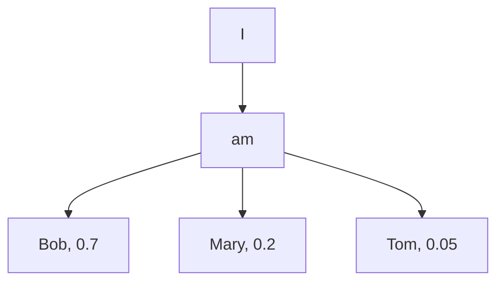
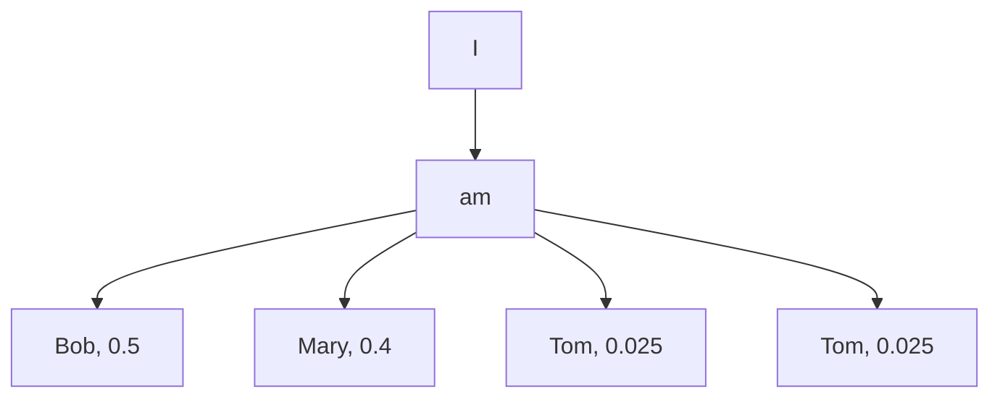
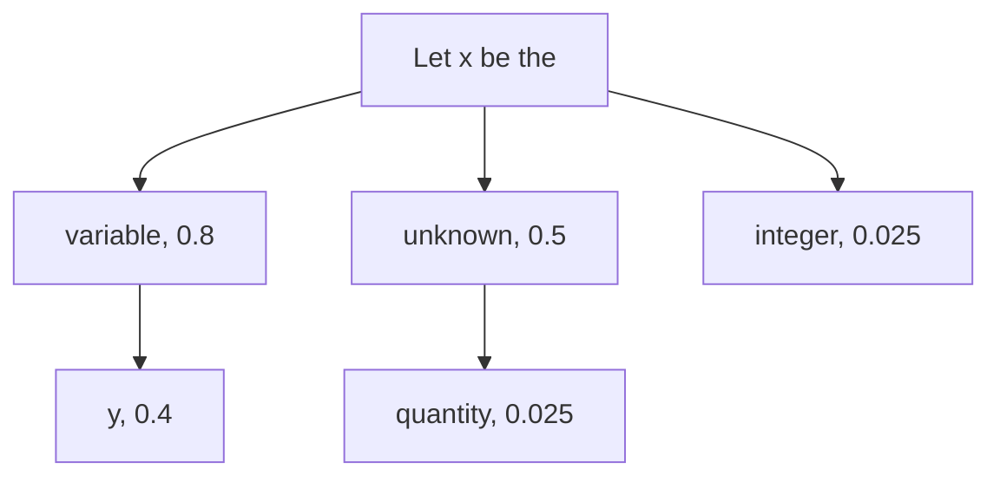

[Accelerated Test-Time Scaling with Model-Free Speculative Sampling](https://arxiv.org/abs/2506.04708)

STAND（STochastic Adaptive N-gram Drafting），无模型投机解码

<!-- more -->

## 动机

Prompt Lookup 背景见：

文章对 Prompt Lookup 进行了优化。达到了更好的加速效果。


使用 `DeepSeek-R1-Distill-Qwen-7B` 在 `AIME-2024` 数据集上发现有大量的 n-gram 重复轨迹。

## Gumbel-Top-K 并行采样

通常在使用 top-k 采样的时候会需要三步，

1. 从分布中找到最大的 k 个概率
2. 将 k 个概率重新归一化
3. 从归一化后的 k 个概率值中再采样

代码实现

```python
import torch
import torch.nn.functional as F

def traditional_topk_sampling(logits, k=10):
    """
    实现传统的Top-K采样。
    
    参数:
    logits (torch.Tensor): 语言模型输出的未归一化对数概率（scores），
                           通常形状为 [batch_size, vocab_size]。
    k (int): 截取概率最高的K个词。
    
    返回:
    torch.Tensor: 从Top-K子集中采样出的下一个token的索引。
    """
    if k <= 0:
        # k=0或更小时，等同于贪婪解码（Greedy Decoding）
        return torch.argmax(logits, dim=-1)

    # 1. 对logits进行排序并获取Top-K值及其索引
    # F.topk返回的是最大的K个值及其在原始张量中的索引
    topk_logits, topk_indices = F.topk(logits, k, dim=-1) # [1]
    
    # 2. 创建一个与原始logits相同形状的零张量
    # 这一步是为了将非Top-K的token概率设为0
    # 在实际应用中，可以通过对logits进行in-place操作来提高效率
    # 但为了代码清晰，这里创建了一个新张量
    zero_logits = torch.full_like(logits, float('-inf'))
    
    # 3. 将Top-K的logits值填充回零张量中
    # 使用scatter_()方法将topk_logits的值分散到zero_logits中的相应索引位置
    topk_logits_filled = zero_logits.scatter_(-1, topk_indices, topk_logits)

    # 4. 对Top-K的logits进行softmax，得到归一化后的概率
    # 这部分是核心，它确保了我们只在选定的K个token上进行概率分布 [2]
    probs = F.softmax(topk_logits_filled, dim=-1)
    
    # 5. 使用torch.multinomial从新的概率分布中进行采样 [2, 5]
    next_token = torch.multinomial(probs, num_samples=1)
    
    return next_token
```

Gumbel-Top-K 并行采样只需要一步就能直接对原始的分布进行 top-k 采样。

主要利用了`Gumbel`噪声，其生成过程为

1. 从标准均匀分布 $U(0,1)$ 中生成一个随机数 $u$。
2. 通过以下公式计算 Gumbel 噪声 $g$:

$$g=−log(−log(u))$$

通过将这个噪声与原分布相加，即可直接采样得到 top-k 采样。其具备数学理论保证。

```python
import torch
import torch.nn.functional as F

def gumbel_topk_parallel_sampling(logits, k=1):
    """
    实现Gumbel-Top-K并行采样，基于Gumbel-Max技巧的推广。
    该方法通过一次性对所有logits添加Gumbel噪声并排序来并行化Top-K选择。
    
    参数:
    logits (torch.Tensor): 语言模型输出的未归一化对数概率（scores），
                           通常形状为 [batch_size, vocab_size]。
    k (int): 需要选择的元素数量。
    
    返回:
    torch.Tensor: 一个包含Top-K采样结果索引的张量，形状为 [batch_size, k]。
    """
    # 1. 生成独立的Gumbel噪声
    # Gumbel噪声可以通过 -log(-log(U)) 生成，其中U是(0,1)上的均匀分布
    # PyTorch的torch.distributions.gumbel.Gumbel可以直接采样标准Gumbel分布G(0,1)
    gumbel_noise = torch.distributions.gumbel.Gumbel(
        torch.zeros_like(logits), torch.ones_like(logits)
    ).sample()
    
    # 2. 向logits中添加Gumbel噪声 [3, 5, 7]
    # 这是Gumbel-Max技巧的核心步骤，将随机采样转化为确定性的argmax操作
    perturbed_logits = logits + gumbel_noise
    
    # 3. 找到扰动后logits的Top-K索引 [3, 6]
    # torch.topk在单个操作中并行地找到前k个最大值及其索引，这使得整个过程高效 [4]
    # 返回的indices是一个张量，其中每一行都包含k个被选中的token索引
    _, topk_indices = torch.topk(perturbed_logits, k, dim=-1)
    
    return topk_indices
```


## STAND 方法

### 构建查找树

第一次见到 `I am` 这个输入，生成的 top-3 token 及其概率如下表所示

| token | 概率 |
| ----- | ---- |
| Bob   | 0.7  |
| Mary  | 0.2  |
| Tom   | 0.05 |




当第二次见到 `I am` 输入的时候，会对这个树进行更新，假设此时生成的 top-3 token  及其概率为

| token | 概率 |
| ----- | ---- |
| Bob   | 0.3  |
| Mary  | 0.6  |
| Sue   | 0.05 |

此时会更新每个节点的概率，

- 对于之前的所有 token，给权重 $k_{prev} / (k_{prev} + 1)$。在第二次的时候，就是 1 / (1 + 1) = 0.5
- 对于新见到的 token，给权重 $1 / (k_{prev} + 1)$。在第二次的时候，是 1 / (1 + 1) = 0.5

即每次更新的 token 权重会越来越弱。

再结合之前的概率，和新见到 token 的概率，重新计算

| token | 概率              |
| ----- | ----------------- |
| Bob   | $0.7\times 0.5+0.3\times 0.5 = 0.5$ |
| Mary  | $0.2\times 0.5+0.6\times 0.5 = 0.4$ |
| Tom   | $0.05\times 0.5=0.025$ |
| Sue   | $0.05\times 0.5=0.025$ |

所以，树会更新为



每次更新树时（或者某个时机），会对这颗树进行裁剪，只**保留概率最高的前10个token及其对应的概率**进行存储。


从实验结果来看，这颗树会变得深且宽。


**深度** 意味着，STAND 在推理阶段可以一次性提供很长的 token 序列以供校验。

### 推理阶段

会从 4-gram 开始在表中搜索，逐步减少至 2-gram。如果 4-gram 查到了，那就不需要搜 3-gram 了

假设在 4-gram 的时候搜索到  `Let x be the`


在表中查到了下面这颗树。



在下一个子节点中找到 10 个概率最大的 token，再从中用 **Gumbel-Top-K ** 并行采样 k 个 token。

不断循环，直至抵达叶子节点。


获取到这些候选句子后，进行并行地校验。


## 结果

构建查找树的是**先验**的，即是一颗**静态**树。会初始化一棵有 625个节点的大树，然后对 AIME-2024 数据集中的 30 个样本进行推测解码。最后选出最有效的前 80 个节点，并将它们重组为一个紧凑的树形结构。

- Trajectories -> 轨迹，生成 N 次的结果
- AIME/GPQA/LCB -> 不同评测集
- T/A -> 表示吞吐量和平均接受长度


这里并没有放模型效果指标，想必是结果不会差。只放了速度对比。其比较大的优势是在采样生成多个句子的时候，收益会更显著。


只生成一次的情况下，也有速度优势。


消融实验，验证了 `Gumbel-Top-K` 会增加一点点速度，比直接贪心选择候选 token 会更快。


- Heuristic/Optimized -> 动态构建树和预先构建好树
- Acc. Lens -> 平均接受长度
- IND/OOD -> 域内和域外

证明
- 预先构建好树会有效果上的提升
- 通过 A 数据集（IND）构建好树，在 B 数据集（OOD）上也会有速度收益