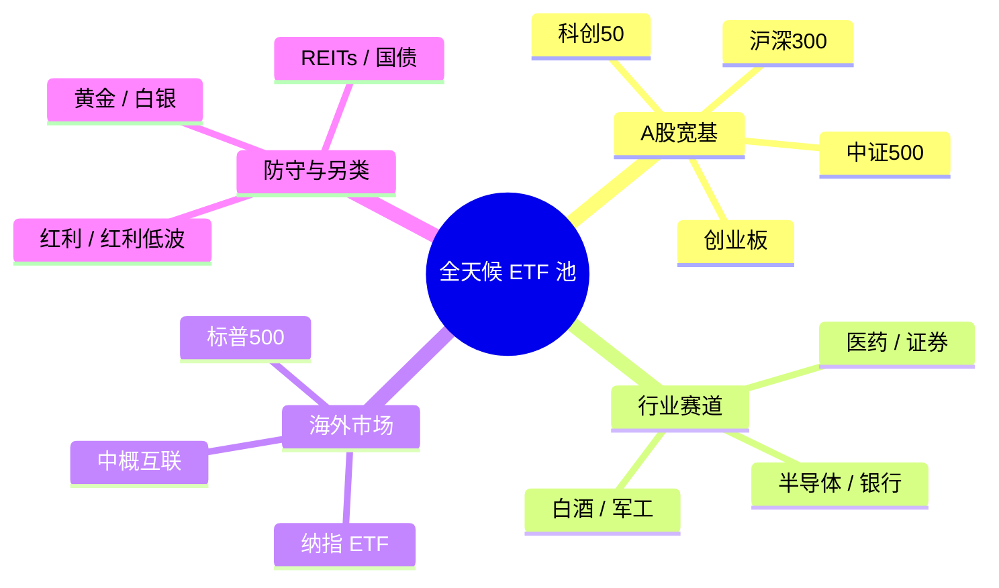
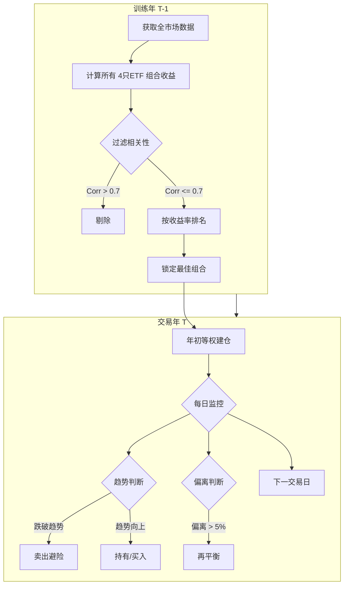

分享一套自用的 ETF 组合投资策略，基于动量、低相关性和均线趋势保护，用 Python 实现自动化选股和风控。

<!-- more -->

## 出发点

投资分析师布朗提出了一个叫做**永久投资组合（Permanent Portfolio）**。这个思路很简单：把钱等分成四份，分别买入四种在不同经济环境下表现好的资产：

| 资产类别 | 占比 | 对应什么经济环境 | 代表 ETF |
|---------|------|----------------|---------|
| 股票（增长） | 25% | 经济繁荣期 | SPY（标普500） |
| 长期国债（避险） | 25% | 经济衰退/通缩期 | TLT（20年+美国国债） |
| 黄金（抗通胀） | 25% | 通胀期 | GLD（黄金ETF） |
| 现金/短期国债（流动性） | 25% | 任何时期的安全垫 | SHV（短期国债） |

这四类资产的逻辑很清晰：经济好的时候股票涨，经济差的时候国债涨，通胀来了黄金涨，实在拿不准就有现金兜底。无论经济处在什么周期，总有一块在赚钱，亏的那部分被其他资产对冲掉。2008 年金融危机的时候，这类多元化配置就比单押股市的跌幅小很多。

操作上也很简单：每半年或一年做一次再平衡，把各资产的比例调回 25%。比如股市涨多了占到 35%，就卖掉一些股票，买入跌了的债券或黄金——本质上就是在自动"卖高买低"。如果某类资产偏离太大（比如超过 35% 或低于 15%），也可以提前触发再平衡。

这个方案的优点是**极其简单，几乎不需要判断**，买了就放着，定期调一下就行。

而投资里面有一个说法是：人是靠不住的。涨了拿不住，跌了不敢买，追涨杀跌这种事说起来都知道不对，真到了自己头上还是很难克制。所以一套规则化的东西，用代码做决策，至少在执行层面不受情绪干扰。

永久投资组合是个很好的起点，但有一些问题：

- 如何选到最优的4只ETF？
- 如何管理仓位？
- 如何应对市场变化？

在开始之前，先铺垫几个基础概念——如果你已经有投资经验，可以直接跳到"三条核心逻辑"。

## 几个基础概念

### ETF 是什么

ETF（Exchange Traded Fund，交易所交易基金）你可以把它理解成"一篮子股票打包卖"。比如沪深 300 ETF，买一份就等于同时持有了 A 股市值最大的 300 家公司的股票，省去了自己一只一只挑的麻烦。它跟普通股票一样在证券账户里买卖，门槛很低，一手通常只要几百块。

选择 ETF 而不是个股，主要两个原因：一是单只 ETF 本身就有分散效果，不会因为某一家公司暴雷就血本无归；二是 ETF 不需要研究财报和基本面，适合用量化的方式来做。

### 均线（MA）

均线就是过去 N 天收盘价的平均值。比如 MA100 就是过去 100 个交易日的均价连成的一条线。它的作用是把日常的涨跌波动"抹平"，看清价格的大方向：价格在均线上方，说明整体趋势向上；反之向下。

后面会用到 MA100 来做趋势判断——连续多天跌破这条线，就认为趋势走坏了。

### 相关性

相关性衡量的是两个东西"是不是总一起动"。相关系数范围从 -1 到 1：接近 1 说明涨跌几乎同步（比如沪深 300 和中证 500，都是 A 股大盘，走势很像），接近 0 说明没什么关系（比如黄金和半导体），接近 -1 说明反着来。

做投资组合时，我们希望持有的几只 ETF 相关性尽量低。如果你买了四只涨跌都同步的 ETF，看起来是分散了，其实跟只买了一只没区别。

### 回测

回测就是把策略拿到历史数据上模拟运行一遍，看看如果过去按这个策略操作，收益和风险会怎样。它不能预测未来，但至少能帮你排除那些在历史上就不 work 的烂主意。

这套策略跑了 2013 到 2025 年共 13 年的历史数据。

## 三条核心逻辑

理解了上面这些概念，核心思路就好说了：

1. **动量效应**：过去一年涨得好的资产，短期内大概率还能继续涨。学术上叫"动量因子"，是被大量研究验证过的市场规律。当然不是百分百，但概率站在你这边。
2. **低相关性**：选出来的几只 ETF 之间相关性要低，涨跌不能太同步。这样一只跌了，另外几只不一定跟着跌，组合整体的波动会小很多。
3. **趋势保护**：跌破均线就跑，别硬扛。不去猜底部在哪，让均线替你判断。留得青山在，不怕没柴烧。

## 资产池：都选了些什么

ETF 池子里可以把所有ETF都放进去，下面仅作例子说明。

简单解释一下这四类：

- **A 股宽基**：跟踪国内大盘指数，比如沪深 300 代表大公司，中证 500 代表中型公司，科创 50 和创业板偏成长型。这些是组合的"基本盘"。
- **行业赛道**：押注特定行业。行业之间周期不同——医药跟半导体的涨跌节奏差别很大，放在一起有天然的分散效果。
- **海外市场**：纳指和标普 500 跟踪美股，跟 A 股走势经常不同步，是分散风险的好帮手。
- **防守与另类**：红利 ETF 靠分红提供稳定回报；黄金白银在通胀和避险的时候表现好；REITs（房地产信托基金）和国债则是跟股市相关性较低的资产。

为什么要覆盖这么广？因为市场是轮动的——经济好的时候股票涨，经济差的时候黄金和国债涨，通胀的时候大宗商品涨。池子里什么都放一点，策略才有得选。

## 每年怎么选出最优组合

每年年初换仓一次，选股流程：

1. 算出池子中所有ETF各自过去一年的收益率
2. 把池子中所有ETF里所有 4 只一组的排列组合都列出来
3. 过滤掉任意两只相关系数超过 0.7 的组合——这一步是关键，把那些"看着是四只、实际涨跌差不多"的假分散给去掉
4. 剩下的里面，选过去一年总收益最高的那个组合

4 只仅是为了对齐永久投资组合，可以自己调整。

这里有一个隐含的假设：去年表现好且低相关的组合，今年大概率也不差。这就是动量效应在起作用。

## 买入之后怎么管理

选好 4 只 ETF 后，等权买入（每只分配 ¥10,000，也就是总共 ¥40,000），然后进入日常监控。日常操作就两件事：

### 趋势保护（最重要的机制）

价格连续 10 个交易日低于 MA100 就清仓，重新站上 MA100 再买回来。举个具体例子：假设你持有纳指 ETF，某天收盘价跌到了 MA100 以下，系统开始计数。如果第二天涨回去了，计数清零，什么都不做。但如果连续 10 天都在 MA100 下方，系统判定趋势走坏，全部卖出。之后每天继续观察，哪天收盘价重新站上 MA100，再买回来。

为什么是 10 天而不是 1 天？因为价格在均线附近反复穿越是很正常的事，如果一跌破就跑，会被频繁"假突破"折腾死。等 10 天是为了确认趋势真的变了，代价是真跌的时候会晚走几天。

### 再平衡

假设你四只 ETF 各买了 ¥10,000，过了一段时间，其中一只涨到了 ¥12,000，另一只跌到了 ¥8,000，它们的权重就不再是各 25% 了。当某只偏离超过 5%，就调整回等权状态——卖掉涨多的，买入跌多的。

## 整体运行流程

最后用一张流程图串起来。策略用"滚动窗口"运行：拿上一年（T-1 年）的数据选组合，在当年（T 年）执行交易，每年年初重新来一轮。

## 回测表现

来看看回测表现：

TODO: 回测表现

这套系统不是用来暴富的，本质上是一个纪律框架：资产池保证选择面够广，相关性过滤保证不会齐涨齐跌，均线保护保证大跌的时候人不在场。

## 存在的问题

建仓时间是不确定的，所以模拟的时候是在 Q1 随机选择一天进行建仓，然后随机五次，收益取平均。