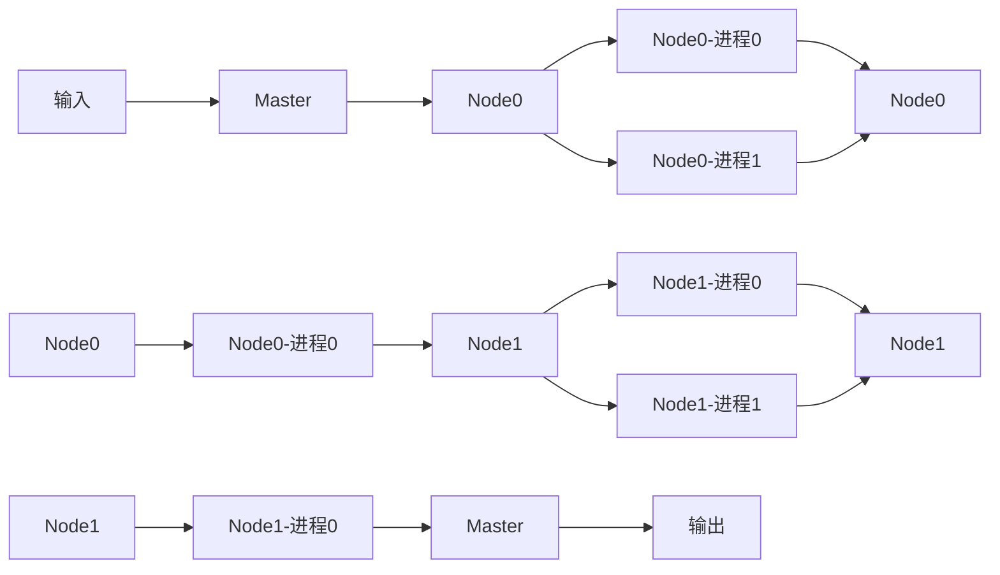
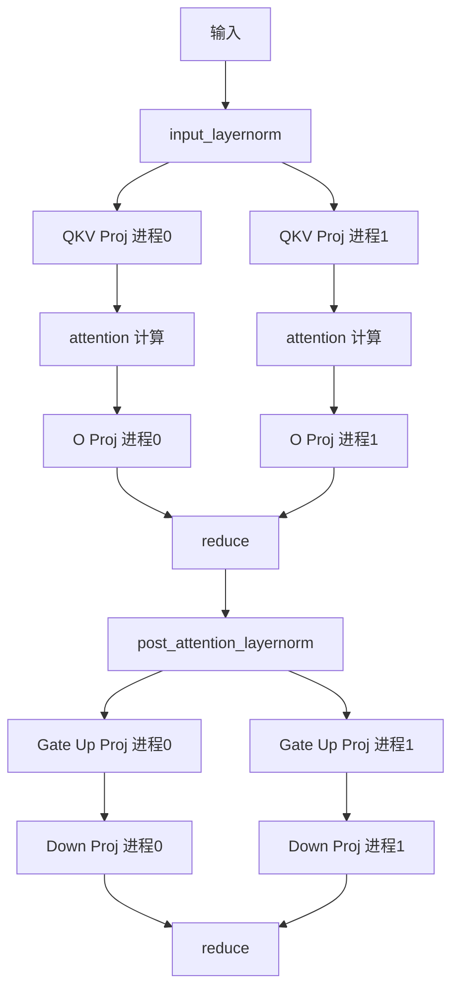
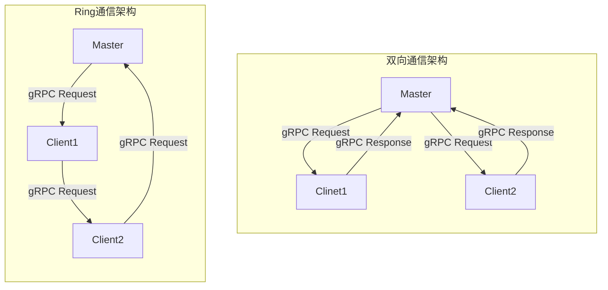

记录开发 tLLM 中通信相关的问题。

<!-- more -->

## 模型跨机通信的原因

- 模型太大单机器放不下

- 模型需要加速

## 怎么做？

- [X] 流水线并行 pipeline-parallel

    - 当前 LLM 架构是由多层串联起来组成的，所以可以拆分成多个部分，每个部分计算一部分，实现流水线作业。

    - PP 通信频率取决于 PP 个数。不加速，仅仅是为了减少单个模型的大小。

- [X] 张量 tensor-parallel

    - 矩阵计算本身具备独立性，即可以拆分并行计算，所以可以对应每个矩阵拆分，分发到不同机器上计算，最后再汇总

    - TP 要求更高的通信频率，适合单机多卡/局域网。不仅减小单机器模型尺寸，主要目的是为了加速，但需要低延迟、高带宽环境。

    - 非 GPU 场景下成功的实践，https://github.com/b4rtaz/distributed-llama

实现主要注意的是，通信时，`reduce` 涉及到一些复杂的规约算法，会有一些精度问题。

## 通信框架选择

由于涉及到跨机器通信，所以期望先选择一个现有的性能较好的通信框架。由于并行需要高频率的通信，所以需要一个高效的通信框架。目前比较好的选择有下面几种

- ray

    - ray 框架更易使用，无需手写 rpc 相关内容，且通信差不多，底层也是 rpc。

    - 但 ray 框架在使用 Tensor Parallel 会比较慢（大概率是实现问题），故暂时先用 torch.dist，可以实现加速的效果。

- torch.dist

    - torch.dist 在 CPU 机器上用 gloo, 在 GPU 机器上用 nccl，可以实现加速的效果。

    - 同时，使用 torch 的多进程共享内存进行 TP 也会更慢。

- rpc: grpc

## Q & A

Q：为什么在单个 nn.Linear 使用 torch.dist 更快，但是在复杂模型中更慢？

A：可能是通信？内存不够？CPU不够？换 CUDA？

Q: 为什么 Merge QKV/gate、up 之后在复杂模型中更慢？

A：内存带宽？多核利用？换 CUDA 效果可能会变好？

在 `src2` 文件夹中，用 grpc 通信 PP，`torch.dist` 通信 TP。当前版本在实现的时候，没有通信 kv cache 和 position_ids，所以是有 bug 的。

在实现的时候，需要注意 grpc 只有一个进程能接收到请求，所以需要该进程同步输入至其他进程，以能够实现 `all.reduce`。有一些额外的通信开销，可以优化。

`torch.dist` 其实是有 rpc 模块的，所以 `src3` 用 torch.dist.rpc 代替了 grpc 实现了跨机器通信，好处在于无需转换数据类型。用 torch.Tensor 通信即可。

## 并行策略

当 TP 和 PP 同时使用的时候，需要兼顾两种通信策略。在实现上，应该是先切 PP 再 TP 比较容易。

整体数据流如下：

输入会发送至 Master 节点，由 Master 节点发送至 Node0 中，由 Node0 同步数据至各个进程，计算完成后再汇总至进程 0，由Node0-进程0发送数据至下一个 Node。重复该流程直至最后一个 Node 完成，由最后一个 Node 的进程 0 发送至 Master 节点，最后由 Master 节点返回输出。

实现过程为了方便会有一定调整：

- Master 节点和 Node0 节点可能是一个节点
- Node0->Node1 的通信实现比较麻烦，暂时会由 Node1-> Master，再由 Master 发送至 Node1

单层 TP 的通信细节实现如下图所示，两个进程一直都存在。图中所示，对于 `input_layernorm`两个进程的输入是一样，但都需要计算一次。计算后的输出也是一样，但是处于不不同的进程。不同的进程执行 attention 计算过程，最后对两个进程的 `O Proj` 的输出进行求和，再分发至两个进程。再执行 `post_attention_layernorm`计算。MLP 的计算过程同理，最后对 `Down Proj` 的输出进行求和，并分发至两个进程以输入至下一层。

经典的实现中 qkv proj 是分三层实现的 Q Proj,K Proj, V Proj，但是这里其实是可以并行，或者说合并为一层进行的，即 QKV Proj。Gate Up Proj 也是同理。具体实现可见 `linear_cases/parallel/merge_linear.py`

### 节点间通信

## 网络要求估算

- PP=8 ，那么通信要求需要 $\times 8$
- 70B 的 hidden_size 是 $8192$
- 数据是 `(b)float16`，每个 token 的通信参数量为 $1*8192*2=16,384$

在 TPOT 阶段预期速度: 20 token/s -> 0.05s / token

- 假设通信：计算比为 1:4，那么通信时间为 0.01s
  - 即每次通信要在 0.01/8s 完成，即 0.00125s -> 1.25ms
  - 70B 的 hidden_size 是 8192，就有 $16,384$ bytes.
  - 故要在 0.01/8s 完成，那么网络带宽至少要求 $16,384/0.01*8=26,214,400 bytes/s = 13 Mbps$。

在 TTFT 阶段，即首 token 时间预期 3s 内有响应，

- 假设通信：计算比为 1:2，那么通信时间为 1s，即每次通信要在 1/8s 完成，即 0.125s -> 125ms
- 假设输入 token 数为 1000，那么通信参数量为 $1000*16,384 = 16,384,000$ bytes
- 1/8s 内完成，通信时间为 $16,384,000/1*8=131,072,000 比特/秒 = 131 Mbps$

优化点：
- 数据压缩一倍，加速一倍
- 在 TTFT 阶段做 PP overlap，把输入 token 分块传输。

## 通信时间测试
token 数较少时压缩似乎效果不大，只有在大数据量的时候才有明显效果。

=== Starting gRPC Matrix Performance Test (use_zlib: False; use_lz4: False) ===

Time: 2024-11-02 11:40:40

| Matrix Shape   |   Transmission(ms) |   Compress(ms) |   Total(ms) |   Throughput(MB/s) |
| ---- | --------- | --- | --- | --- | 
| (1, 8192)      |              14.05 |           0.01 |       14.06 |               2.22 |
| (4, 8192)      |              29.89 |           0.01 |       29.90 |               4.18 |
| (16, 8192)     |              76.95 |           0.01 |       76.97 |               6.50 |
| (32, 8192)     |             137.05 |           0.01 |      137.06 |               7.30 |
| (64, 8192)     |             262.03 |           0.01 |      262.04 |               7.63 |

=== Starting gRPC Matrix Performance Test (use_zlib: False; use_lz4: True) ===

Time: 2024-11-02 11:51:41

| Matrix Shape   |   Transmission(ms) |   Compress(ms) |   Total(ms) |   Throughput(MB/s) |
| ---- | --------- | --- | --- | --- | 
| (1, 8192)      |              18.10 |           0.08 |       18.18 |               1.73 |
| (4, 8192)      |              30.82 |           0.19 |       31.01 |               4.06 |
| (16, 8192)     |              78.23 |           2.80 |       81.02 |               6.39 |
| (32, 8192)     |             136.85 |           5.62 |      142.47 |               7.31 |
| (64, 8192)     |             249.84 |          10.37 |      260.20 |               8.01 |

=== Starting gRPC Matrix Performance Test (use_zlib: True; use_lz4: False) ===

Time: 2024-11-02 11:41:51

| Matrix Shape   |   Transmission(ms) |   Compress(ms) |   Total(ms) |   Throughput(MB/s) |
| ---- | --------- | --- | --- | --- | 
| (1, 8192)      |              13.95 |           1.96 |       15.91 |               2.24 |
| (4, 8192)      |              32.74 |           9.82 |       42.56 |               3.82 |
| (16, 8192)     |              77.19 |          32.65 |      109.84 |               6.48 |
| (64, 8192)     |             256.25 |          83.67 |      339.92 |               7.80 |

TODO: Meta-Llama-3-8B-Instruct in GPU

- 多维数组实现（float32）: 单机通信在 0.002 s 左右 （seq-len=1）
- bytes 实现（float32）: 单机通信在 0.001 s 左右 （seq-len=1）
